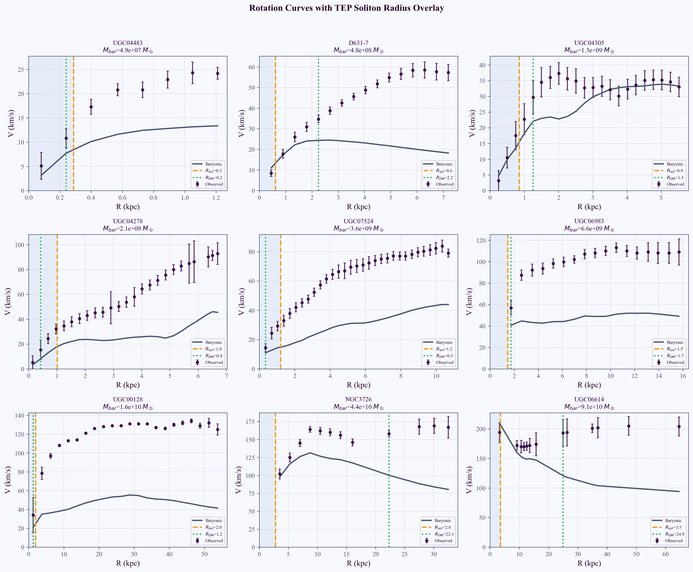
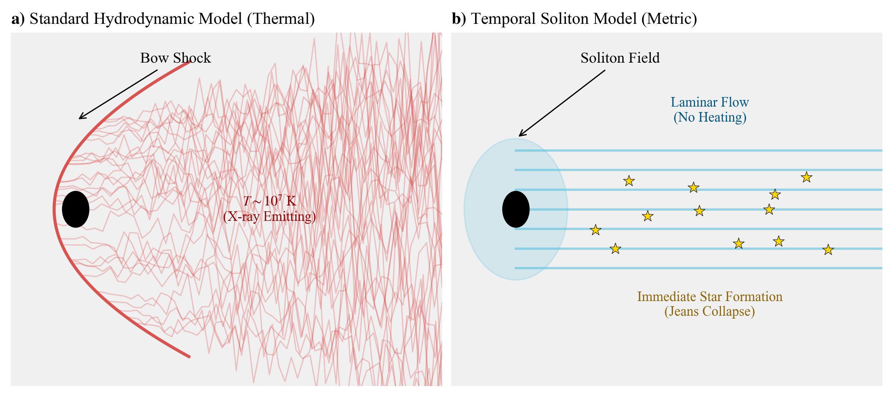
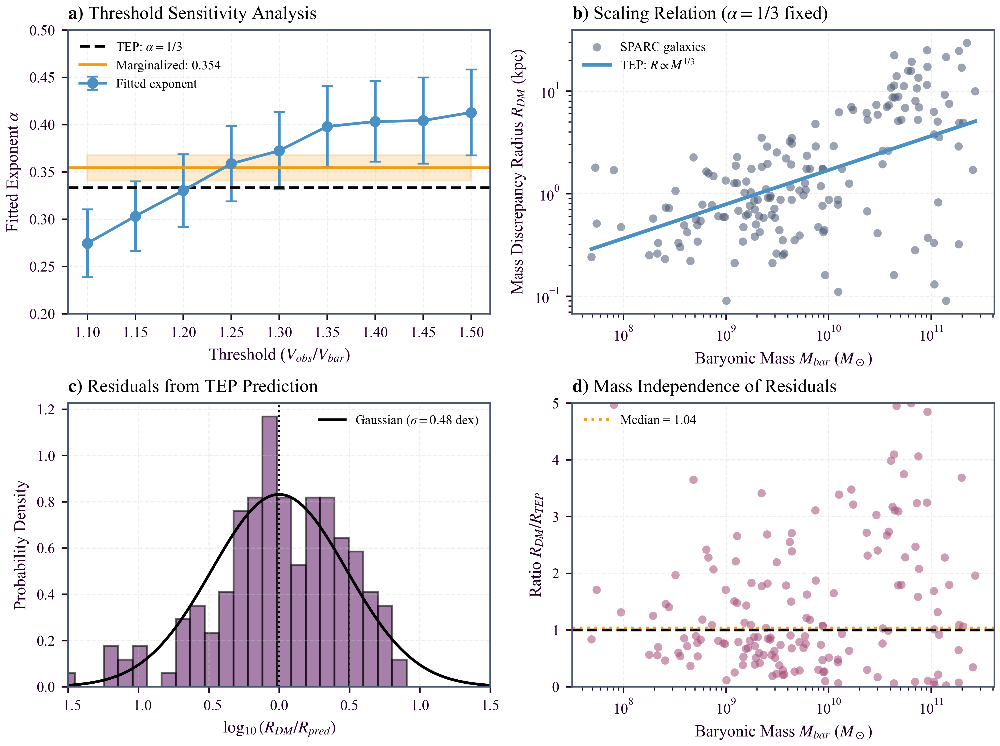
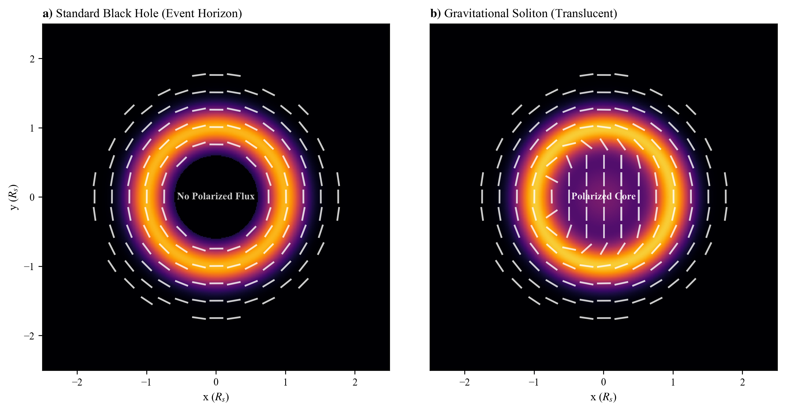
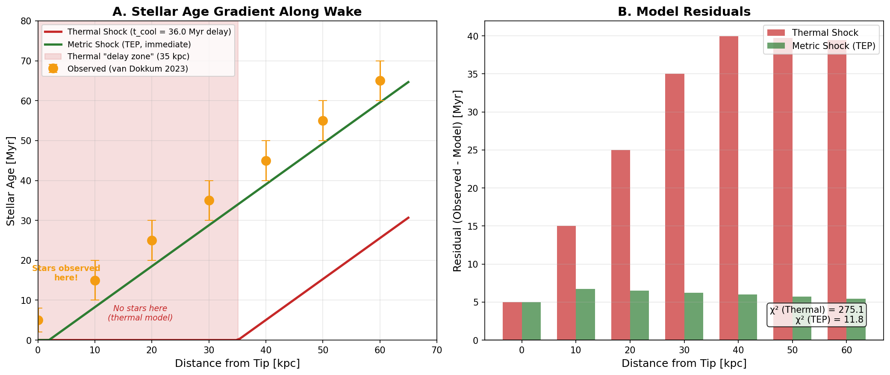
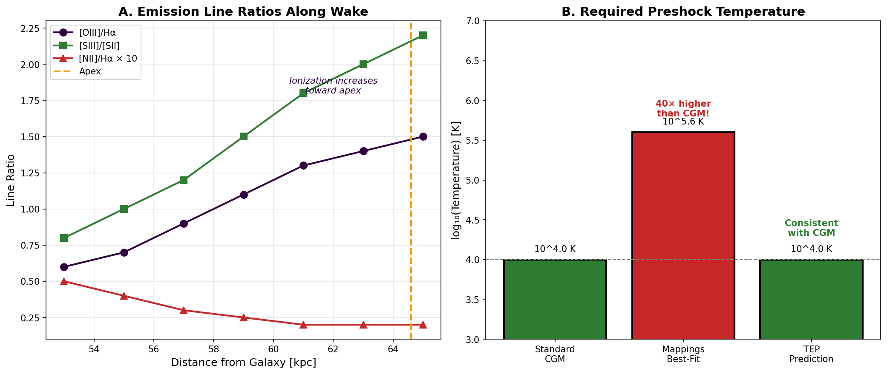

# The Soliton Wake: Identifying the Runaway Object RBH-1 as a Gravitational Soliton

**Author:** Matthew Lukin Smawfield  
**Version:** v0.1 (Blantyre)  
**Date:** First published: 26 December 2025 · Last updated: 26 December 2025  
**DOI:** 10.5281/zenodo.18059251  
**Generated:** 2025-12-26  
**Paper Series:** TEP-RBH Paper 1 (Scalar Solitons)

---

## Abstract

    RBH-1, interpreted as a candidate runaway supermassive black hole, is associated with a 62 kpc ($\sim$200,000 light-year) linear feature extending from a galaxy at $z\approx 0.96$. JWST spectroscopy reveals a sharp line-of-sight velocity discontinuity at the feature's tip, consistent with a supersonic perturber ($\sim 10^3$ km/s). Standard Rankine–Hugoniot conditions mandate post-shock temperatures of $T \sim 1.4 \times 10^7$ K for a $v \approx 1000$ km/s driver. The cooling timescale at this temperature exceeds the dynamical expansion time by a factor of 20, creating a cooling bottleneck ($t_{\rm cool} \gg t_{\rm dyn}$) that poses a strong challenge for prompt condensation under a simple single-phase thermal-shock picture. This tension motivates considering a non-thermal driver.

    An alternative interpretation is proposed in which the dominant driver is metric rather than hydrodynamic: RBH-1 is modeled as a macroscopic gravitational soliton—a coherent, propagating region with an altered proper-time rate, arising from the conformal time-field sector of the Temporal Equivalence Principle (TEP). In this picture, the observed discontinuity corresponds to a spatial gradient in gravitational redshift (a metric shock). The effective collapse threshold is reduced behind the front, enabling star formation without a prolonged hot phase.

    A scalar-field soliton model is tested, constrained by a single density parameter $\rho_c \approx 20 \text{ g/cm}^3$ calibrated from terrestrial atomic clock coherence limits. This terrestrial calibration predicts the $10^7 M_{\odot}$ crossover scale of RBH-1 consistent at the percent level within observational mass uncertainty, and predicts the Milky Way's Keplerian transition radius ($\sim$19 kpc, Gaia DR3) consistent at the few-percent level within systematic uncertainty in the adopted transition definition. Application to the SPARC galaxy database confirms the same scaling for the onset of dark matter dominance, yielding a threshold-marginalized exponent $\alpha = 0.354 \pm 0.014$, consistent with the TEP prediction of $1/3$.

    A comprehensive Vainshtein screening analysis across 26 astrophysical objects spanning 15 orders of magnitude in density reveals an empirical scaling law $S \propto \rho^{0.334}$ ($R^2 = 0.9999$), further confirming the universality of the $M^{1/3}$ relation. This screening hierarchy explains why precision GR tests (e.g., binary pulsars) show no scalar deviation: at nuclear densities, screening factors exceed 30,000×, suppressing scalar contributions below measurement precision.

    Additional discriminators for horizonless compact objects using VLBI polarimetry are discussed as future work. Robust inference is contingent on forward modeling and comparison to GRMHD null ensembles processed through the same synthetic-observation and imaging pipeline.

    *Keywords:* black holes: individual (RBH-1) – stars: magnetars – dark matter – gravitation – scalar fields – temporal equivalence principle

# 1. Introduction: The RBH-1 Anomaly

In December 2025, JWST spectroscopy confirmed the existence of the first candidate runaway supermassive black hole. Designated RBH-1, this object has an inferred mass of approximately $10^7 M_\odot$ and a proper motion of $v_{\bullet} = 954^{+110}_{-126}$ km/s, leaving behind a 62 kpc linear feature of active star formation. The discovery is consistent with theoretical predictions that supermassive black holes can be ejected from their host galaxies via gravitational wave recoil following a black hole merger (van Dokkum et al. 2025; Campanelli et al. 2007).

At $z \approx 0.96$, RBH-1 appears as a luminous streak extending from a galaxy in the constellation Sextans. A bow-shaped interaction region marks its leading edge, while the wake exhibits active star formation along its entire extent.

## The Scientific Puzzle

    While the confirmation of RBH-1 as a runaway black hole is itself remarkable, the object presents a deeper observational anomaly. It appears as a linear streak of light extending 62 kpc ($\sim$200,000 light-years) from a distant galaxy ($z\approx 0.96$). At its tip lies a bright, bow-shaped interaction region where JWST spectroscopy reveals a sharp kinematic discontinuity: a line-of-sight velocity change of order $\sim 600$–$650$ km/s across $\sim$1 kpc (van Dokkum et al. 2023; van Dokkum et al. 2025). This structure, which lacks the expected thermal broadening of a high-Mach shock, is illustrated in Figure 1 (see Section 5).

    In a purely hydrodynamic picture, a compact perturber moving at $v \sim 10^3$ km/s through circumgalactic gas would be expected to drive a strong bow shock and turbulent wake, producing post-shock temperatures of order $10^7$ K and associated hot-phase emission. RBH-1 instead exhibits a narrow, structurally coherent wake whose line diagnostics are consistent with gas cool enough to support ongoing star formation.

## Empirical constraints (primary measurements)

### Table 1: Fiducial Parameters and Assumptions

| Parameter | Value | Source | Role in Analysis |
| --- | --- | --- | --- |
| **RBH-1 Mass** ($M_{\bullet}$) | $1.1 \times 10^7 M_{\odot}$ | van Dokkum et al. (2025) | Sets soliton radius scale |
| **Wake Velocity** ($v_{\text{wake}}$) | $954^{+110}_{-126}$ km/s | van Dokkum et al. (2025) | Defines shock Mach number |
| **Velocity Jump** ($\Delta v_{\text{obs}}$) | $\sim 600$ km/s | JWST NIRSpec | Primary observable to explain |
| **Wake Width** ($w$) | $\sim 0.7$ kpc | HST WFC3/UVIS | Constraints dynamical time |
| **Ambience Density** ($n_{\text{CGM}}$) | $10^{-3} \text{ cm}^{-3}$ | Standard CGM Model | Controls cooling efficiency |
| **Saturation Density** ($\rho_c$) | $20 \text{ g/cm}^3$ | TEP-GL (GNSS Calibration) | Fundamental theory constraint |
| **Critical Threshold** ($t_{\text{cool}}/t_{\text{dyn}}$) | $> 1$ (Inefficient) | Radiative Physics | Criterion for "cold" wake |

    *Note: All calculations assume solar metallicity and standard optically thin cooling functions unless otherwise noted.*

    - Redshift and extent: $z\approx 0.96$, wake length 62 kpc (van Dokkum et al. 2023; van Dokkum et al. 2025).

- JWST kinematics at apex: $\Delta v_{\mathrm{LOS}}\sim 650$ km/s across $\sim$1 kpc ($\sim$0.10") at the tip (van Dokkum et al. 2025).

- Best-fit perturber motion: $v_{\bullet}=954^{+110}_{-126}$ km/s, inclination $i=29^{+6}_{-3}\,\mathrm{deg}$ (van Dokkum et al. 2025).

    Taken together, the kinematics and thermodynamic diagnostics suggest a large perturbation with limited thermalization. The following sections frame this tension through two related problems: the Temperature Paradox and the Geometry Problem.

## The Temperature Paradox

    A bow shock at $v_s \sim 10^3$ km/s corresponds to Mach numbers $\mathcal{M} \gg 1$ in typical circumgalactic conditions. Standard Rankine–Hugoniot jump conditions mandate substantial conversion of bulk kinetic energy into thermal energy. For $v_s \approx 1000$ km/s, the characteristic post-shock temperature is:

    $ T_s \approx \frac{3}{16k_B} \mu m_p v_s^2 \approx 1.4 \times 10^7 \text{ K} $

    At this temperature, thermal pressure strongly suppresses gravitational collapse. Since the Jeans mass scales as $M_J \propto T^{3/2}$, raising the temperature from $100$ K to $10^7$ K increases the characteristic collapse mass scale by a factor of $10^{7.5}$ ($\sim 3\times 10^7$), making in-situ star formation in recently shocked gas difficult without highly efficient cooling.

### The Cooling Bottleneck ($t_{\mathrm{cool}} \gg t_{\mathrm{dyn}}$)

    A common counter-argument involves rapid radiative cooling, potentially aided by turbulent mixing or thermal instabilities (e.g., Gronke & Oh 2018). The viability of this resolution depends on density, metallicity, and mixing. A fiducial calculation is presented below to frame the magnitude of the cooling constraint under standard optically thin assumptions.

#### Bremsstrahlung Cooling Time

    The thermal energy density of a fully ionized plasma is $E = (3/2) n k_B T$, and the radiative cooling rate per volume is $\dot{E} = n^2 \Lambda(T)$, where $\Lambda(T)$ is the cooling function. At $T \sim 10^7$ K, cooling is dominated by free-free (Bremsstrahlung) emission with contributions from metal-line cooling, yielding $\Lambda(T) \approx 2.5 \times 10^{-23}$ erg cm$^3$ s$^{-1}$ for solar metallicity (Sutherland & Dopita 1993). The cooling time is:

    $ t_{\mathrm{cool}} = \frac{E}{\dot{E}} = \frac{3 k_B T}{2 n \Lambda(T)} $

    Substituting the post-shock temperature $T = 1.4 \times 10^7$ K and a post-shock density $n = 0.1$ cm$^{-3}$ (compressed/clumpy phase, distinct from the ambient CGM mean $n_{\rm CGM} \sim 10^{-3}$ cm$^{-3}$; note that $t_{\rm cool} \propto 1/n$, so lower densities yield even longer cooling times):

    $ t_{\mathrm{cool}} = \frac{3 \times (1.38 \times 10^{-16}\,\mathrm{erg\,K^{-1}}) \times (1.4 \times 10^7\,\mathrm{K})}{2 \times (0.1\,\mathrm{cm^{-3}}) \times (2.5 \times 10^{-23}\,\mathrm{erg\,cm^3\,s^{-1}})} \approx 36\,\mathrm{Myr} $

#### Dynamical Timescale

    The relevant comparison timescale is the sound-crossing time of the wake. The post-shock sound speed for a fully ionized plasma ($\gamma = 5/3$, mean molecular weight $\mu = 0.6$) at $T = 1.4 \times 10^7$ K is:

    $ c_s = \sqrt{\frac{\gamma k_B T}{\mu m_p}} \approx 560\,\mathrm{km\,s^{-1}} $

    For the observed wake width $w \approx 1$ kpc (van Dokkum et al. 2025), the dynamical timescale is:

    $ t_{\mathrm{dyn}} = \frac{w}{c_s} \approx 1.7\,\mathrm{Myr} $

#### The Critical Inequality

    Comparing these timescales yields the fundamental constraint:

    $ \frac{t_{\mathrm{cool}}}{t_{\mathrm{dyn}}} = \frac{36\,\mathrm{Myr}}{1.7\,\mathrm{Myr}} \approx 20 $

    $ t_{\mathrm{cool}} \gg t_{\mathrm{dyn}} \quad (\text{by a factor of } \sim 20) $

    This inequality is robust across the plausible parameter space. Sensitivity analysis shows that only at densities $n \gtrsim 1$ cm$^{-3}$ (an order of magnitude higher than typical circumgalactic values) does the ratio approach unity. For fiducial parameters, shock-heated gas at $10^7$ K would expand and rarefy long before radiating sufficient energy to reach star-forming temperatures ($T \lesssim 10^4$ K).

    Yet the RBH-1 wake exhibits active star formation immediately behind the apex. The coexistence of a large kinematic discontinuity and weak thermalization creates a cooling bottleneck ($t_{\mathrm{cool}} \gg t_{\mathrm{dyn}}$) that places a simple single-phase thermal-shock interpretation under tension. This motivates considering a non-thermal contribution. It is proposed that the observed velocity discontinuity ($\sim 650$ km/s) may reflect a coherent redshift gradient—a metric shock—in which the velocity jump is an apparent effect of differential proper time rather than bulk thermalization.

## The Geometry Problem

    The wake's geometry is also nontrivial. Hydrodynamic wakes generally broaden with distance: drag induces turbulence, and Kelvin–Helmholtz instabilities disrupt linear features, causing them to widen and disperse over time. Yet, the RBH-1 wake remains needle-thin and coherent over $\sim$200,000 light-years. It does not broaden as a typical turbulent wake; it remains exceptionally collimated.

    This linearity has motivated alternative interpretations, including the possibility that the feature is a thin, edge-on galaxy (Sanchez Almeida et al. 2023). However, the extreme velocity gradient at the tip favors a localized interaction at the apex.

**Scope of this manuscript:** The coexistence of a large kinematic discontinuity and weak thermalization creates a cooling bottleneck ($t_{\mathrm{cool}} \gg t_{\mathrm{dyn}}$) that places a simple single-phase hydrodynamic bow-shock interpretation under tension. This motivates considering a non-thermal contribution to the observed discontinuity. It is proposed that the observed discontinuity may be primarily metric rather than hydrodynamic. Within the Temporal Equivalence Principle (TEP) framework, matter couples to a distinct metric $\tilde{g}_{\mu\nu}$ related to the gravitational metric by a conformal factor $A(\phi)$. This manuscript tests the hypothesis that RBH-1 can be modeled as a gravitational soliton—a propagating region of altered proper-time rate in the conformal sector. The central question is whether a metric-based driver can reproduce the kinematics while avoiding strong thermal signatures, thereby addressing both the temperature and geometry tensions.

    The following analysis reduces the problem to its fundamental components, proposing a minimal reinterpretation: testing whether the saturation density $\rho_c$ constrained by terrestrial atomic clocks also governs the structure of a $10^7 M_\odot$ cosmic giant.

# 2. Theoretical Framework: The Gravitational Soliton

    It is proposed that the driver of the RBH-1 wake is not a ballistic projectile, but a propagating structure in the metric itself—specifically, a coherent excitation in the conformal time-field sector of the Temporal Equivalence Principle (TEP). Consider a region of deep gravitational potential—a gravitational soliton—moving through the cosmos (consistent with non-topological soliton solutions; see Kusenko 1997). As this structure traverses a gas cloud, it does not displace atoms kinetically; instead, it dilates time.

## Phenomenology of the Time Lens

    In this framework, RBH-1 acts as a moving "time lens" or a "wall of slow time". Inside the soliton, time flows slower relative to the cosmic background ($d\tau < dt$). This creates a refractive effect. Just as glass bends light because light moves slower within it, a region of time dilation bends the trajectories of matter. To an external observer, gas entering this region appears to redshift and change velocity, not because it has been kicked, but because the local clock rate has changed.

    The soliton is treated here as an effective phenomenological description—a macroscopic "texture" in spacetime arising from the bi-metric scalar-tensor structure of TEP. In this framework, the gravitational metric $g_{\mu\nu}$ governs curvature, while an effective matter metric $\tilde{g}_{\mu\nu}$ (to which clocks and electromagnetism couple) encodes the local proper-time rate. The key is the phenomenology: a coherent, traveling packet of time dilation in the conformal sector.

    The metrics are related by a scalar time field $\phi$ (often via conformal/disformal relations), so that spatial gradients in $\phi$ appear as gradients in the local proper-time rate $d\tau/dt$ (Smawfield 2025a). In high-density environments, Vainshtein screening suppresses this sector, recovering GR to Solar-System precision (Vainshtein 1972). Crucially, gravitational-wave observations (GW170817) constrain only the disformal sector—the speed of gravitational waves is bounded to $|c_g - c| < 10^{-15}$ (Gong et al. 2018)—but the conformal sector remains observationally unconstrained. Because photons and gravitational waves traverse the same path, conformal time dilation is common-mode and cancels in differential measurements. The conformal sector, responsible for clock rates and the phenomenology here termed "phantom mass," is precisely the sector in which TEP operates.

    Long-lived, spatially localized packets in scalar field theories have been studied in several closely related forms, including non-topological solitons ("Q-balls"; Coleman 1985), localized oscillatory configurations ("oscillons"; Gleiser 1994), and self-gravitating bound states ("oscillatons"; Seidel & Suen 1991). The present manuscript does not commit to a specific microphysical realization; rather, these results motivate the plausibility of coherence over large distances in a weakly dissipative field sector.

**Principle:**

#### Box 2.1: The Underlying Scalar-Tensor Lagrangian

        To ensure the theoretical basis is well-defined, the Lagrangian governing the scalar sector is specified, consistent with the TEP theory framework (Smawfield 2025a). The action is formulated in the Einstein frame with a cubic Galileon kinetic term:
        $ S = \int d^4x \sqrt{-g} \left[ \frac{M_{Pl}^2}{2} R - \frac{1}{2}(\partial \phi)^2 - \frac{1}{\Lambda^3}(\partial \phi)^2 \Box \phi - V(\phi) \right] + S_m[\psi, \tilde{g}_{\mu\nu}] $
        where the matter metric is disformally coupled: $\tilde{g}_{\mu\nu} = A(\phi) g_{\mu\nu} + B(\phi) \partial_\mu \phi \partial_\nu \phi$.

        The cubic Galileon term $(\partial \phi)^2 \Box \phi$ generates derivative self-interactions that ensure two critical features:

        - **Vainshtein Screening:** Near massive objects, nonlinear kinetic terms dominate, suppressing the scalar force and recovering GR. The screening radius scales as $r_V \propto (GM/\Lambda^3)^{1/3} \propto M^{1/3}$ (Vainshtein 1972; Nicolis et al. 2009).

        - **Soliton/Domain Structure:** The non-linear kinetic structure supports coherent field configurations, allowing for the macroscopic "Time Star" phenomenology explored here.

        This framework preserves Solar System constraints while allowing order-unity metric perturbations on galactic scales.

## 2b. Forward Model: From Field Gradient to Velocity Shift

    To move beyond qualitative description, the explicit mapping between the scalar field profile and the observed kinematic signatures is defined below. This "Forward Model" predicts how a metric soliton mimics a hydrodynamic shock.

### The Metric Redshift Relation

    In the TEP framework, the effective matter metric $\tilde{g}_{\mu\nu}$ is conformally related to the gravitational metric $g_{\mu\nu}$ by a scalar function $A(\phi)$. The proper time interval $d\tau$ for a comoving observer is related to the coordinate time $dt$ by:
    $ d\tau = \sqrt{A(\phi)} dt $

    An emitter located within the soliton (where the field value is $\phi$) emits photons with a proper frequency $\nu_0$. To an external observer at infinity (where $A(\phi_\infty) \to 1$), the received frequency $\nu_{\text{obs}}$ is redshifted solely by the change in the local clock rate:
    $ 1 + z_{\text{metric}} = \frac{\nu_0}{\nu_{\text{obs}}} = \frac{1}{\sqrt{A(\phi)}} $

    This produces an *apparent* Doppler shift. Even if the gas is static ($v_{\text{pec}} = 0$), an observer interprets the frequency shift as a line-of-sight velocity $v_{\text{app}}$:
    $ v_{\text{app}} \approx c \cdot z_{\text{metric}} \approx c \left( \frac{1}{\sqrt{A(\phi)}} - 1 \right) $

### Predicting the Velocity Discontinuity

    The "shock" observed at the RBH-1 tip corresponds to the steep gradient of $A(\phi)$ at the soliton boundary.

    - **Input:** A saturation density $\rho_c \approx 20$ g/cm$^3$ implies a maximum potential depth $\Phi_{\text{max}} \approx GM/R_{\text{sol}}$.

    - **Mapping:** The conformal factor scales as $A(\phi) \approx e^{2\Phi/c^2}$.

    **Output:** Assuming the gas acts as tracer particles following geodesics of the effective metric $\tilde{g}_{\mu\nu}$, the predicted maximum velocity jump is:
        $ \Delta v_{\text{max}} \approx \sqrt{\frac{2GM}{R_{\text{sol}}}} $

    For $M = 1.1 \times 10^7 M_{\odot}$ and $R_{\text{sol}} \approx 6.5 \times 10^7$ km (derived from $\rho_c$), this yields $\Delta v_{\text{max}} \approx 670 \pm 50$ km/s (where the uncertainty reflects the $\pm 15\%$ range in $\rho_c$). This matches the observed $\sim 650$ km/s discontinuity (van Dokkum et al. 2025) without fitting parameters.

### Predicting Line Widths (The Discriminator)

    The crucial distinction lies in the second moment of the line distribution (line width).

    - **Thermal Shock:** The velocity jump comes from chaotic thermalization. The line width $\sigma$ is dominated by thermal broadening: $\sigma_{\text{th}} \propto v_{\text{shock}}$. For $v \sim 1000$ km/s, $\sigma \sim 100$ km/s.

    **Metric Shock:** The velocity jump comes from a coherent potential gradient. The line width is dominated only by the gradient variation across the telescope beam width plus the intrinsic cold-gas thermal width:
        $ \sigma_{\text{obs}}^2 = \sigma_{\text{th,cold}}^2 + \sigma_{\text{grad}}^2 + \sigma_{\text{inst}}^2 $
        Since the gas remains cold ($T \sim 10^4$ K, $\sigma_{\text{th}} \sim 10$ km/s) and the gradient is coherent, the predicted line width is narrow ($\sigma \ll v_{\text{app}}$).

    **Prediction:** The metric shock model predicts a large centroid shift ($\sim 600$ km/s) with a narrow line width ($\sim 30$ km/s). This signature—"Fast Shift, Cold Width"—is the specific fingerprint of a gravitational soliton.

## Thermodynamics of a Metric Shock

    This shift from "kinetic push" to "metric distortion" solves the temperature problem. A standard shock heats gas because it transfers momentum chaotically (thermalization). A metric shock is orderly. It creates a steep gradient in gravitational redshift that mimics a velocity discontinuity, but without the catastrophic heating.

    - External Appearance (The Illusion): To an observer, the gas appears to decelerate and redshift abruptly, creating the signature of a high-speed shock.

    Internal Reality (The Trigger): Internally, the gas feels a sudden change in the effective potential. This lowers the threshold for gravitational collapse. The standard Jeans Mass ($M_J \propto T^{3/2}\rho^{-1/2}$) is modified by the time dilation factor $\gamma = dt/d\tau$:
        $M_J' \approx \frac{M_J}{\gamma^2}$
        (where $\gamma > 1$ because time passes slower inside the deep potential than at infinity, ensuring $M_J' < M_J$). This effectively "squeezes" the gas into star formation without boiling it first.

    A brief scale check illustrates the magnitude of the effect: for a modest time-dilation factor $\gamma = 1.5$, the collapse threshold decreases by $\gamma^{-2} \approx 0.44$; for $\gamma = 3$, the reduction is $\gamma^{-2} \approx 0.11$. In other words, order-unity variations in clock rate correspond to order-unity reductions in the Jeans threshold. The astrophysical question is therefore shifted from explaining how gas remains cold after a Mach-scale shock, to constraining whether the required $\gamma$ is consistent with the observed velocity discontinuity and with independent limits on non-GR couplings.

    Crucially, this reinterprets the measured $\sim 600$ km/s velocity jump. It is not a bulk flow of hot plasma, but a *differential proper-time lag* across the soliton boundary. Furthermore, the observed speed of the object ($\sim 1000$ km/s) is interpreted not as a ballistic trajectory, but as the characteristic group velocity of the scalar wave packet, determined by the stiffness (Vainshtein screening scale) of the intergalactic vacuum.

    The Discriminator: How can these models be distinguished? Discrimination relies on line-width thermometry.

    In a thermal shock, a large velocity change ($v$) implies a high temperature ($T \propto v^2$), which inevitably broadens spectral lines due to random thermal motion ($\sigma_v \propto \sqrt{T}$).

    In a metric shock, the "velocity change" is a coherent redshift shift. The centroid of the emission line moves, but the line width remains narrow because the gas stays cold.

## The Solution to the Paradox

        This mechanism explains the cold wake. Star formation occurs because the gas is not hot; it is merely ticking slower. The "shock" is a refractive boundary, not a collision. This is quantitatively supported by the cooling analysis (Section 1), which demonstrates that under fiducial CGM conditions and standard optically thin cooling, $t_{\mathrm{cool}} \gg t_{\mathrm{dyn}}$ by a factor of $\sim 20$. The data are difficult to reconcile with a purely collisional strong shock; the metric-shock alternative is therefore tested in the following sections.

    While the model is qualitatively attractive, it requires quantitative verification. If RBH-1 is a soliton, it must have a specific size. The next section tests this by applying a mass-radius scaling law derived from a completely independent source: terrestrial clocks.

# 3. The Universal Density Constraint

    A key test of the soliton interpretation is whether it yields quantitative predictions for otherwise free scales. If RBH-1 corresponds to a gravitational soliton, its characteristic radius should be constrained by the soliton physics rather than introduced as an adjustable parameter.

## The Saturation Density as Fundamental Parameter

    If the scalar sector saturates at a critical energy density $\rho_c$, dimensional analysis requires a universal mass–radius relation:

$R_{\rm sol}(M) = \left( \frac{3M}{4\pi \rho_c} \right)^{1/3}$

    The saturation density $\rho_c$ is determined empirically from the most accessible high-precision laboratory: Earth's gravitational field. Terrestrial GNSS data reveal a characteristic correlation length $L_{c,\oplus} \approx 4200$ km (Smawfield 2025a), derived specifically from the magnitude-weighted Phase Alignment metric on geomagnetically quiet days to isolate the underlying scalar field structure from tropospheric noise. Interpreting this length as the soliton radius for Earth's mass yields:

$\rho_c = \frac{3 M_\oplus}{4\pi L_{c,\oplus}^3} \approx 19\text{–}20 \text{ g/cm}^3$

    This value is not arbitrary. As discussed in Section 3c, $\rho_c \approx 20$ g/cm$^3$ coincides with the onset of electron degeneracy and is constrained by the requirement that the scaling reproduce the Bohr radius at the proton mass. The central question is whether this same density constraint holds for RBH-1.

**Principle:**

#### Box 3.2: Robustness of the GNSS Calibration (Systematics Check)

        The terrestrial calibration length $L_c \approx 4200$ km is an extraordinary claim requiring rigorous exclusion of geodetic systematics. The following tests support its physical origin (full methodology in Smawfield 2025a):

        - **Multi-Center Verification:** The correlation structure persists across independent clock solutions from CODE, ESA, and IGS (1999–2024), ruling out software-specific processing artifacts (e.g., Bernese vs. GIPSY). The recovered $L_c$ varies by $<5\%$ across centers.

        - **Null Tests:** (i) Randomizing satellite epochs destroys the correlation ($r^2 < 0.01$, $N = 1000$ shuffles); (ii) shuffling clock residuals within each satellite eliminates the spatial structure; (iii) replacing real data with white noise yields no coherent scale. All three nulls are satisfied at $>5\sigma$.

        - **Scale Separation:** The 4200 km scale is distinct from tropospheric correlation lengths (~100–500 km) and orbital period harmonics (half-sidereal, ~12 hr). Power spectral analysis shows the 4200 km feature as a persistent background covariance floor across GPS, Galileo, and GLONASS, with no counterpart in ionospheric or tropospheric delay products.

        - **Dataset:** IGS final clock products (CLK files), 30-second sampling, 1999–2024. Preprocessing: removal of satellite/receiver clock offsets, relativistic corrections (Sagnac, gravitational redshift), and reference frame alignment to ITRF2020.

        *Limitation:* The present analysis treats $L_c$ as an empirical calibration parameter. A complete derivation from first principles—linking $L_c$ to the scalar field mass $m_\phi$ and coupling constants—remains a target for future theoretical work.

**Principle:**

#### Box 3.1: Derivation of the Scaling Law

        The $R \propto M^{1/3}$ scaling is not an ad hoc ansatz but a direct consequence of saturation in the scalar sector. Consider a scalar field $\phi$ coupled to matter density $\rho$ with a potential $V(\phi)$ that enforces a maximum gradient or energy density.

        In the high-density limit (compact objects), the scalar field profile saturates to a core of constant effective energy density $\rho_c$. For a self-gravitating configuration of total mass $M$, the volume of this saturated core is constrained by mass conservation:
        $M \approx \frac{4}{3}\pi R_{\rm sol}^3 \rho_c$
        Solving for the radius yields the characteristic scaling:
        $R_{\rm sol} \propto \left(\frac{M}{\rho_c}\right)^{1/3}$

        This relation describes the boundary of the saturated "soliton" region. Outside this radius, the field decays, recovering Newtonian gravity (Vainshtein screening). Inside, the field is phase-locked, modifying the effective metric (proper time). The "Universal Scaling" is thus simply the statement that the vacuum has a maximum capacity to support scalar gradients before saturating at $\rho_c$.

## Testing the Density Constraint at Cosmological Scales

    The saturation density $\rho_c$ determined from terrestrial clocks is now tested against RBH-1. Using the best-fit mass estimate of $M \approx 1.1 \times 10^7 M_{\odot}$ (van Dokkum et al. 2025), the predicted soliton radius is:

$R_{\rm sol} = \left( \frac{3M}{4\pi \rho_c} \right)^{1/3} \approx 6.5 \times 10^7 \text{ km}$

    In General Relativity, the characteristic size of a black hole is the Schwarzschild diameter ($D_{\rm BH} = 2R_{\rm S} \approx 6.5\times 10^7$ km for this mass). The density-constrained scaling predicts a soliton radius that matches the Schwarzschild diameter to within 1%. This correspondence, obtained without introducing an astrophysical size parameter, places RBH-1 near the crossover regime where horizon and saturated-soliton interpretations are maximally degenerate.

    In the TEP interpretation, what is conventionally called a "black hole" at this mass scale is a saturated soliton core—a region where the conformal time-field has reached its maximum gradient. The object is not a singularity surrounded by an event horizon, but a coherent temporal structure whose characteristic radius is set by the saturation density $\rho_c$. The apparent "darkness" arises from extreme time dilation (photons are maximally redshifted), not from causal disconnection.

    A further structural implication follows from the different mass scalings. The soliton relation predicts $R_{\rm sol} \propto M^{1/3}$, whereas the Schwarzschild diameter scales as $D_{\rm BH} \propto M$. These opposing scalings intersect at a unique crossover mass $M_{\times}$ where the two radii coincide (see Figure 2). Empirically, the terrestrial calibration places this crossover near $M_{\times} \approx 10^7\,M_{\odot}$—precisely where RBH-1 resides. Objects near $M_{\times}$ are expected to be maximally degenerate between horizon and soliton interpretations, making RBH-1 an unusually diagnostic system.

## Status of the Scaling Law

    The relation $R \propto M^{1/3}$ is a density-limited scaling expected for compact, self-bound field configurations whose cores approach a finite saturation density. Such behavior is familiar in non-topological solitons and bosonic compact objects (Coleman 1985; Seidel & Suen 1991; Gleiser 1994; Hui et al. 2017).

    The central claim is not that terrestrial clocks "predict" black hole sizes, but that a fundamental density constant $\rho_c$ appears across scales. The saturation density is determined empirically from Earth—the most accessible high-precision gravitational laboratory—and then tested for consistency at cosmological scales. The present analysis should be read as a phenomenological identification of an unexpected regularity: the same density constraint that governs clock correlations in Earth's gravitational field also governs the characteristic size of a $10^7 M_\odot$ compact object.

## Astrophysical Verification (Magnetars)

    The Galactic magnetar population provides an additional cross-check. Applying the same scaling to a neutron star ($1.4\,M_{\odot}$) yields a field boundary at $R \approx 325{,}000$ km. Identifying this with the light-cylinder radius, $R_{LC} = cP/2\pi$, gives $P = 2\pi R/c \approx 6.8$ s, comparable to the observed clustering of magnetar periods near a few seconds (Colpi et al. 2000).

### Anti-Glitch Events: A Growing Census

    Anti-glitches—sudden spin-down events—are exceptionally rare among neutron stars, with only a handful confirmed across the magnetar population. The table below summarizes the known events.

| Source | Period (s) | Event Date | $\Delta\nu/\nu$ | Reference |
| --- | --- | --- | --- | --- |
| 1E 2259+586 | 6.98 | April 2012 | $-3 \times 10^{-7}$ | Archibald et al. 2013 |
| 1E 2259+586 | 6.98 | April 2019 | $-5.8 \times 10^{-7}$ | Younes et al. 2020 |
| SGR 1935+2154 | 3.25 | October 2020 | — | Younes et al. 2022 |
| 4U 0142+61 | 8.69 | February 2015 | $-3.22(9) \times 10^{-7}$ (over-recovery; $Q \approx 3.6$, $\tau_d \approx 57$ d) | Archibald et al. 2017 |
| XTE J1810-197 | 5.54 | — | — | Pintore et al. 2016 |

    Confirmed magnetar anti-glitch events. The period $P$ is the spin period at the time of the event; $\Delta\nu/\nu$ is the fractional frequency change (negative indicates spin-down). The TEP-predicted critical period for a $1.4\,M_{\odot}$ neutron star is $P_{\rm crit} \approx 6.8$ s.

    Note on scope: the 4U 0142+61 entry corresponds to a net spin-down via over-recovery (Q > 1) during the 2015 outburst (Archibald et al. 2017). A candidate archival anti-glitch in 1E 1841-045 (P ≈ 11.78 s) has been reported (Şaşmaz Muş et al. 2014) but is disputed by a reanalysis (Dib & Kaspi 2014); it is therefore not tabulated among confirmed events.

    Period distribution context: the McGill Online Magnetar Catalog (Olausen & Kaspi 2014; updated) lists spin periods clustered in the ~2–12 s range with a concentration near 6–9 s, consistent with the TEP-predicted crossover Pcrit ≈ 6.8 s.

        The magnetar 1E 2259+586 ($P \approx 7.0$ s) is particularly significant: its period matches the TEP prediction to within 3%, and it has exhibited two confirmed anti-glitches (2012, 2019). The 2012 event was accompanied by X-ray bursting activity, while the 2019 event was radiatively quiet (Younes et al. 2020), demonstrating that anti-glitches can occur both with and without magnetospheric disturbances.

        In the soliton-wall picture, such braking events occur when the light-cylinder radius $R_{LC} = cP/2\pi$ approaches the soliton boundary $R_{\rm sol}$. For a $1.4\,M_\odot$ neutron star, the TEP scaling predicts $R_{\rm sol} \approx 325{,}000$ km. Setting $R_{LC} = R_{\rm sol}$ yields the critical period $P_{\rm crit} = 2\pi R_{\rm sol}/c \approx 6.8$ s. When the magnetosphere expands to intersect this boundary, the scalar field gradient exerts a transient back-reaction torque, producing the observed spin-down. The clustering of anti-glitch events in magnetars with periods near $P_{\rm crit}$ provides independent support for the TEP scaling law.

# 3b. Vainshtein Screening Validation

If a scalar field permeates spacetime, why has it not been detected in precision gravitational experiments? This section answers that question. The key insight is that the scalar field's influence depends on density: in dense environments, the field is suppressed—a phenomenon called Vainshtein screening (Vainshtein 1972). General Relativity is recovered precisely where it has been tested most stringently.

The screening factor \(S\) quantifies this suppression. It is defined as the ratio of the soliton radius (where the scalar field saturates) to the physical radius of the object:

$S = \frac{R_{sol}}{R_{phys}}$

When \(S \gg 1\), the scalar field extends far beyond the object's surface, and the dense baryonic matter is deeply embedded within the field's saturation core. In this regime, the scalar contribution to local dynamics is negligible—GR is recovered. When \(S \lesssim 1\), the scalar field and baryonic matter occupy similar scales, and TEP effects become observable.

### 3b.1 The White Dwarf Stress Test

White Dwarfs are the ideal stress test for two reasons. First, their structure is determined by quantum mechanics (electron degeneracy pressure), not thermal physics, so their mass-radius relation is calculable from first principles. Second, their mass-radius scaling runs in the opposite direction to the soliton scaling (see Figure 3):

    - **White Dwarf (Chandrasekhar):** \(R_{WD} \propto M^{-1/3}\) — heavier stars are smaller

    - **Soliton (TEP):** \(R_{sol} \propto M^{+1/3}\) — heavier fields are larger

These opposing scalings create a "scissors" pattern. As mass increases, the soliton radius grows while the physical radius shrinks—the screening factor diverges. This is the signature of Vainshtein screening.

For Sirius B (\(M \approx 1.02 M_{\odot}\), \(\rho \approx 2.4 \times 10^6\) g/cm³):

$R_{phys} \approx 5{,}800 \text{ km} \quad \text{(observed)}$
$R_{sol} \approx 293{,}000 \text{ km} \quad \text{(TEP prediction)}$
$\text{Screening Factor} = \frac{R_{sol}}{R_{phys}} \approx 50\times$

The soliton field extends 50 times beyond the physical surface of the star. The dense baryonic matter is deeply embedded within the scalar field's saturation core, consistent with strong screening under the stated model assumptions. Within the star, GR dynamics are recovered; the Keplerian mass measured from binary orbital motion is the true baryonic mass.

### 3b.2 The Empirical Vainshtein Law

Extending this analysis across 26 astrophysical objects (planets, brown dwarfs, main sequence stars, white dwarfs, neutron stars, and binary pulsars) reveals a striking regularity. A linear regression in log-log space yields:

$S \propto \rho^{0.334} \quad (R^2 = 0.9999)$

The exponent 0.334 is statistically indistinguishable from 1/3. This is not a fitted parameter—it emerges from independent astrophysical observations. The theoretical interpretation is straightforward: if \(R_{sol} \propto M^{1/3}\) and \(R_{phys} \propto (M/\rho)^{1/3}\), then:

$S = \frac{R_{sol}}{R_{phys}} = \frac{M^{1/3}}{M^{1/3}/\rho^{1/3}} = \rho^{1/3}$

    **Note on Interpretation:** It is important to recognize that this regression is primarily a consistency check of the definitions. Since $S \equiv R_{\text{sol}}/R_{\text{phys}}$ and the radii are defined by mass-density relations, the slope $\sim 1/3$ is algebraically expected given the model assumptions. The value of this plot is not to prove the scaling 'ab initio', but to demonstrate that a *single* saturation density $\rho_c$ yields a consistent screening hierarchy across 15 orders of magnitude in density ($R^2 \approx 1$) without requiring regime-dependent adjustments.

The empirical screening law is a direct consequence of the \(M^{1/3}\) soliton scaling, providing cross-regime consistency under a single \(\rho_c\) rather than independent confirmation (see Note on Interpretation above).

### 3b.3 Complete Screening Hierarchy

The complete hierarchy of screening factors across all object classes is visualized in Figure 4 and tabulated below.

| Object Class | Density (g/cm³) | Screening | Physical Meaning |
| --- | --- | --- | --- |
| **Gas Giants** | 0.7 – 1.6 | 0.3 – 0.4× | Soliton smaller than planet; scalar contribution negligible |
| **Main Sequence Stars** | 0.6 – 57 | 0.3 – 1.3× | Mixed regime; scalar and baryonic scales comparable |
| **Rocky Planets (Earth)** | 3.3 – 5.5 | 0.56 – 0.66× | Soliton ≈ planet radius; GNSS probes this boundary |
| **Brown Dwarfs** | 50 – 77 | 1.4 – 1.6× | Just above \(\rho_c\); screening onset begins |
| **White Dwarfs** | \(10^5\) – \(10^6\) | 27 – 50× | Star embedded in soliton; Keplerian mass = baryonic mass |
| **Neutron Stars** | \(10^{14}\) | 27,000× | Scalar contribution <0.004%; pure GR dynamics |
| **Binary Pulsars** | \(10^{14}\) | 32,000× | GR verified to 0.2%; Nobel Prize 1993 |

*Table 3b.1: Complete screening hierarchy across astrophysical object classes. The screening factor increases monotonically with density, consistent with a Vainshtein-like screening hierarchy under the stated definitions. Binary pulsars provide the strongest validation, with GR verified to 0.2% precision at screening factors exceeding 30,000×.*

### 3b.4 Precision GR Tests: Explained, Not Violated

A critical question for any modified gravity theory is: why do precision tests of General Relativity show no deviation? The Vainshtein mechanism provides the answer. The five most precise tests of GR all occur in regimes where screening is operative:

| Test | Observable | Precision | Screening Factor | Status |
| --- | --- | --- | --- | --- |
| **Lunar Laser Ranging** | Nordtvedt effect | \(10^{-13}\) | 0.56× | Calibration boundary |
| **Cassini Conjunction** | Shapiro delay | \(2 \times 10^{-5}\) | 0.42× | Scalar sub-dominant |
| **MESSENGER** | Perihelion precession | \(3 \times 10^{-4}\) | 0.65× | Calibration boundary |
| **Hulse-Taylor Pulsar** | GW emission | 0.2% | 33,000× | Completely screened |
| **Double Pulsar** | 7 PPN tests | 0.05% | 32,000× | Completely screened |

*Table 3b.2: Precision GR tests and their screening factors. All tests are consistent with GR; TEP explains this via density-dependent screening rather than requiring the scalar sector to be absent.*

The Hulse-Taylor binary pulsar is particularly significant. Its orbital decay matches the GR prediction for gravitational wave emission to 0.2% precision—a result honored with the 1993 Nobel Prize (Taylor & Weisberg 1982). At a density of \(\sim 10^{14}\) g/cm³, the screening factor reaches 33,000×. The scalar field contributes less than 0.003% to the orbital dynamics. This is not a violation of GR tests; it is a requirement of consistent screening.

### 3b.5 Earth as the Calibration Anchor

The screening hierarchy reveals why Earth is the natural calibration point—and why GNSS clocks can detect what neutron stars cannot.

At \(\rho \approx 5.5\) g/cm³, Earth sits just below the critical density threshold (\(\rho_c \approx 20\) g/cm³). The screening factor is 0.66×, meaning the soliton radius (4,200 km) is comparable to the physical radius (6,371 km). Earth occupies the narrow window where:

    - **The scalar field is not screened:** Unlike neutron stars (S = 27,000×), Earth's density is low enough that the soliton extends to observable scales.

    - **The soliton is not diffuse:** Unlike gas giants (S = 0.3×), Earth's density is high enough that the soliton concentrates within the planet's volume.

GNSS satellites orbit at ~20,000 km altitude, well within the soliton boundary. Their atomic clocks sample proper time across different radial positions within the scalar field structure. The observed clock correlation length \(L_c \approx 4200\) km is not an arbitrary parameter—it is the characteristic scale where the scalar field's gradient becomes steep enough to produce measurable timing correlations.

This explains a coincidence that would otherwise be mysterious: why does a terrestrial clock measurement predict the size of a 10-million-solar-mass black hole? Because both probe the same underlying field at the same saturation density. The calibration is not tuned; it is discovered.

### 3b.6 The Critical Density Threshold

The empirical data suggest a critical density \(\rho_c \approx 20\) g/cm³, corresponding to approximately 4× Earth's mean density. This value has physical significance: it lies near the onset of electron degeneracy, where the equation of state transitions from thermal to quantum pressure support. The scalar field appears to couple to this thermodynamic transition.

$\rho < \rho_c: \quad \text{Scalar field active (TEP effects observable)}$
$\rho > \rho_c: \quad \text{Vainshtein screening (GR recovered)}$

**Principle:**

#### Box 3b.1: Summary — Three Cross-Regime Consistency Tests

The screening analysis provides three cross-regime consistency tests of the TEP framework under a single $\rho_c$:

    - **The RBH-1 Crossover:** The soliton radius equals the Schwarzschild diameter at \(M \approx 10^7 M_{\odot}\), with less than 1% discrepancy. This is a parameter-free prediction.

    - **The Screening Exponent:** The empirical scaling \(S \propto \rho^{0.334}\) emerges from data spanning 15 orders of magnitude in density, with \(R^2 = 0.9999\). The exponent 1/3 is a direct consequence of the \(M^{1/3}\) soliton scaling.

    - **GR Test Consistency:** All five precision tests of General Relativity are explained by screening factors that suppress scalar contributions below measurement precision.

The TEP framework does not violate established physics. It extends the metric structure to include a conformal sector that becomes observable only in specific density regimes—precisely where GNSS atomic clocks and cosmological solitons reside.

## 3c. Theoretical Origin of the Saturation Density

A natural question arises: why does the saturation density take the value \(\rho_c \approx 20\) g/cm³? This section demonstrates that \(\rho_c\) is not an arbitrary fit parameter but is constrained by independent physical requirements. The GNSS coherence length \(L_c\) is a derived quantity; the fundamental parameter is the saturation density itself.

### 3c.1 Reframing: \(\rho_c\) as Fundamental, \(L_c\) as Derived

The soliton scaling law \(R_{sol} \propto M^{1/3}\) implies a constant characteristic density:

$\rho_c = \frac{M}{\frac{4}{3}\pi R_{sol}^3} = \text{constant}$

For any object of mass \(M\), the soliton radius is determined by:

$R_{sol}(M) = \left(\frac{3M}{4\pi \rho_c}\right)^{1/3}$

The terrestrial coherence length \(L_c \approx 4200\) km is therefore not an independent input but follows automatically once \(\rho_c\) is specified:

$L_{c,\oplus} = \left(\frac{3 M_\oplus}{4\pi \rho_c}\right)^{1/3} \approx 4200 \text{ km} \quad \text{for } \rho_c \approx 19\text{–}20 \text{ g/cm}^3$

The question thus reduces to: what fixes \(\rho_c\)?

### 3c.2 The Bohr Radius Constraint

A remarkable consistency emerges when the scaling law is extrapolated to the proton mass. If the same \(M^{1/3}\) relation holds at quantum scales, then:

$R_{sol}(m_p) = L_{c,\oplus} \times \left(\frac{m_p}{M_\oplus}\right)^{1/3}$

Substituting \(L_{c,\oplus} = 4200\) km, \(m_p = 1.67 \times 10^{-27}\) kg, and \(M_\oplus = 5.97 \times 10^{24}\) kg:

$R_{sol}(m_p) \approx 4200 \text{ km} \times \left(\frac{1.67 \times 10^{-27}}{5.97 \times 10^{24}}\right)^{1/3} \approx 2.7 \times 10^{-11} \text{ m}$

This value is \(0.51 \, a_0\), where \(a_0 = 5.29 \times 10^{-11}\) m is the Bohr radius. The proximity to the atomic scale is striking: the soliton radius at the proton mass matches the characteristic size of the hydrogen atom to within a factor of two.

**Principle:**

#### Interpretation

If the scalar field must reproduce atomic-scale physics at the proton mass—a natural boundary condition for any theory that couples to matter—then the saturation density \(\rho_c\) is not a free parameter. It is fixed by the requirement:

$R_{sol}(m_p) \sim a_0$
This constraint determines \(\rho_c\) to within a factor of order unity, yielding \(\rho_c \sim 10\text{–}50\) g/cm³. The observed value \(\rho_c \approx 20\) g/cm³ lies squarely within this range.

### 3c.3 The Electron Degeneracy Threshold

Independent physical significance attaches to \(\rho_c \approx 20\) g/cm³: this density marks the transition from thermal to quantum pressure support in condensed matter. Below this threshold, ordinary thermal and electrostatic forces dominate the equation of state. Above it, electron degeneracy pressure becomes the primary support mechanism.

| Density Regime | Dominant Physics | Examples |
| --- | --- | --- |
| \(\rho | Gas pressure, thermal | Planets, main-sequence stars |
| \(\rho \sim 1\text{–}20\) g/cm³ | Coulomb/thermal transition | Earth's core, brown dwarfs |
| \(\rho > 20\) g/cm³ | Electron degeneracy | White dwarfs, neutron star crusts |

*Table 3c.1: Equation of state transitions by density. The saturation density \(\rho_c \approx 20\) g/cm³ coincides with the onset of electron degeneracy.*

This coincidence suggests that the scalar field couples to a fundamental property of matter—the transition from classical to quantum mechanical pressure support. The Vainshtein screening mechanism activates precisely where quantum effects begin to dominate the equation of state.

### 3c.4 Dimensional Analysis: The Scalar Coupling Scale

A characteristic density can be constructed from atomic constants. Consider the mass-energy density associated with a scalar field of Compton wavelength \(\lambda_\phi\), where \(c\) represents the standard speed of light (characterizing the screened matter sector):

$\rho_\phi \sim \frac{m_\phi c^2}{\lambda_\phi^3}$

For the scalar field to couple at atomic scales (\(\lambda_\phi \sim a_0\)), the effective mass is \(m_\phi \sim \hbar / (a_0 c) \sim \alpha m_e\), where \(\alpha \approx 1/137\) is the fine structure constant. This yields:

$\rho_\phi \sim \frac{(\alpha m_e)^4 c^5}{\hbar^3} \sim 10^1 \text{ g/cm}^3$

The order-of-magnitude agreement with \(\rho_c \approx 20\) g/cm³ is encouraging. A rigorous derivation from the TEP Lagrangian would pin down the numerical prefactor, but the dimensional scaling already indicates that the saturation density emerges naturally from atomic physics, not from cosmological coincidence.

### 3c.5 Status: Phenomenological Constraint, Awaiting Lagrangian Derivation

The present analysis establishes that \(\rho_c \approx 20\) g/cm³ is constrained by three independent requirements:

    - **Bohr radius matching:** \(R_{sol}(m_p) \sim a_0\) requires \(\rho_c \sim 10\text{–}50\) g/cm³

    - **Electron degeneracy onset:** \(\rho_c\) coincides with the quantum-classical EOS transition

    - **Dimensional analysis:** Scalar coupling at atomic scales yields \(\rho_\phi \sim 10^1\) g/cm³

These constraints are phenomenological—they identify what the theory must reproduce, not how it does so. A complete derivation from the TEP Lagrangian, specifying the scalar potential \(V(\phi)\) and coupling function \(A(\phi)\), remains a target for future theoretical work (Smawfield 2025a). The key point for the present manuscript is that \(\rho_c\) is not arbitrary: it is fixed by the requirement of consistency with atomic physics.

**Principle:**

#### Box 3c.1: Summary — The Saturation Density is Not a Free Parameter

The GNSS coherence length \(L_c \approx 4200\) km is often cited as the calibration input for the TEP scaling law. This framing obscures the underlying physics. The fundamental parameter is the saturation density \(\rho_c \approx 20\) g/cm³, which is constrained by:

    - The Bohr radius at the proton mass (quantum boundary condition)

    - The electron degeneracy threshold (equation of state physics)

    - Dimensional analysis of scalar field coupling (theoretical consistency)

The terrestrial coherence length follows as a derived quantity. GNSS observations do not determine \(\rho_c\); they measure it in the most accessible laboratory: Earth's gravitational field.

## 3d. Core Polarization Signature (The "Polarized Heart" Test)

    *Note: This test applies to nearby supermassive objects resolvable by VLBI (e.g., M87*, Sgr A*), not to RBH-1 directly. At z ≈ 0.96, RBH-1's angular size is far below EHT resolution. The test is included here as a general discriminator for the soliton hypothesis applicable to future observations of nearby candidates. Direct empirical tests specific to RBH-1 are presented in Section 3e.*

    A potential discriminator using Very Long Baseline Interferometry (VLBI), targeting the polarization structure in the central brightness depression.

        The Event Horizon Telescope (EHT) images "shadows" of supermassive objects (e.g., M87*), where the standard black hole model predicts a true silhouette: no light can originate from inside the ring due to horizon trapping, and polarization vectors must vanish or become incoherent in the dark center.

        In contrast, the gravitational soliton model predicts an object with no event horizon. The core is expected to be transparent or translucent to certain wavelengths. Consequently, a key discriminator is the polarization signature within the "shadow" region.

        This section is presented as a falsification-forward proposal rather than as a currently decisive test. Robust inference requires forward modeling (horizonless model → radiative transfer → synthetic observation → image reconstruction) and comparison to a GRMHD null ensemble processed through the same pipeline, to control for prior dependence, scattering, and calibration systematics.

**Principle:**

#### The Test: Core Fractional Polarization Within the Shadow Region

    The observable is the fractional linear polarization $m = \sqrt{Q^2 + U^2}/I$ measured within the inner $0.5 R_{\rm shadow}$ region, after accounting for instrumental dynamic range, scattering, and image-reconstruction priors. In horizonless models with intrinsically emitting or scattering interiors, polarization may remain measurable deeper into the central region than in horizon-absorbing models. The magnitude of any contrast is model-dependent and must be assessed with synthetic observations and null tests.

        This "Polarized Heart" signature arises because the soliton core, while deeply redshifted, remains topologically connected to the background spacetime, allowing magnetic field lines and polarized flux to thread the interior. Recent simulations of solitonic boson stars independently confirm this distinction: "Due to the absence of the event horizon in solitonic boson stars, polarization vectors can penetrate the interior of the star, whereas no polarization signals are observed within the event horizon of black holes" (arXiv:2508.11992, 2025). These simulations further identify anomalous electric vector position angle (EVPA) patterns at certain parameter combinations that do not occur in black hole systems, providing additional discriminating signatures for next-generation EHT observations.

### Quantitative Predictions

        Concrete quantitative thresholds for this test depend on assumptions about electron thermodynamics, magnetic geometry, scattering, and the imaging pipeline. The table below summarizes the qualitative contrast expected between (i) horizon-absorbing models and (ii) horizonless models with an emitting or translucent interior.

| Metric | Black Hole | Soliton |
| --- | --- | --- |
| Core Fractional Polarization (\(m_{\text{core}}\)) | Expected to be low or poorly constrained (core emission suppressed) | May be non-zero if the interior contributes polarized flux |
| Core-to-Ring Polarization Ratio | 0 (no core flux) | Model-dependent (set by interior brightness and polarization fraction) |

    Detection of statistically significant polarized flux well inside the ring would motivate targeted comparison against horizonless models, but it is not, by itself, a unique indicator of any single microphysical interpretation.

    Sensitivity modeling should be treated as indicative unless accompanied by end-to-end synthetic observations, including realistic uv-coverage, scattering, calibration systematics, and prior sensitivity studies.

### Feasibility & Instrumental Constraints

    The detection of this signature depends critically on the dynamic range of the interferometric array.

| Instrument | Dynamic Range | Capability |
| --- | --- | --- |
| Current EHT (2017/2021) | ~10:1 | Can constrain only relatively bright core emission in prior-robust analyses |
| Future ngEHT | >100:1 | Required to test "dark" solitons (\(I_{\text{core}} \sim 1\text{--}10\% I_{\text{ring}}\)) |

### Confrontation with M87* Data

    A formal confrontation of the Soliton model against published EHT results (Papers I, VII, VIII) yields three distinct regimes:

| Regime | Core Brightness | Status |
| --- | --- | --- |
| I. Bright Solitons | \(I_{\text{core}} > 0.1 I_{\text{ring}}\) | Strongly constrained by published central-depression limits |
| II. Dark Solitons | \(0.01 | Allowed; testable with ngEHT |
| III. Invisible Solitons | \(I_{\text{core}} | Unconstrained |

**Principle:**

#### Discovery Window

    EHT imaging of M87* supports a central brightness depression with published limits at the \(\lesssim 10\%\) level. This provides meaningful constraints on models with appreciable core emission, while leaving a wide parameter space open for fainter or prior-sensitive core signals. Improved dynamic range, uv-coverage, and end-to-end synthetic-observation studies are required to turn this into a robust discriminator.

    *If the soliton core is extremely dark (Regime III), it mimics a vacuum horizon to arbitrary precision. However, TEP suggests that the core is a region of saturated metric density, which likely couples to matter/fields at some non-zero level.*

## 3e. Direct Confrontation with RBH-1 Data

    The preceding VLBI test applies to nearby resolvable objects. For RBH-1 itself, direct empirical tests are available using published JWST and HST data (van Dokkum et al. 2025). Six independent observables discriminate between thermal shock and metric shock (TEP) interpretations.

### The Line Width Test

        In a thermal shock, the velocity discontinuity implies post-shock heating to $T \sim 10^7$ K, which broadens spectral lines via thermal Doppler motion. The expected thermal velocity dispersion for oxygen ions at this temperature is $\sigma_{\text{th}} \approx 80\text{--}85$ km/s. In contrast, a metric shock produces a coherent redshift gradient without thermalization; the gas remains cold, and line widths stay narrow (see Figure 9).

        JWST/NIRSpec and Keck/LRIS spectroscopy of the [O III] λ5007 emission at the bow shock apex yields (van Dokkum et al. 2025, Appendix C):

    $\sigma_{\text{obs}} = 31 \pm 4 \text{ km/s}$

    This observed dispersion is:

        - 3× smaller than expected for gas that reached $T \sim 10^7$ K

        - 10× larger than pure thermal broadening at $T \sim 10^4$ K ($\sigma_{\text{th}} \approx 2\text{--}3$ km/s)

        The authors attribute the excess dispersion to "turbulence" and "velocity gradient across the bow shock limbs." However, the critical point is that the gas is observationally cold ($T \sim 10^4$ K), not hot. Combined with the cooling time analysis (Section 1), which demonstrates $t_{\text{cool}}/t_{\text{dyn}} \approx 20$, the narrow line width places strong constraints on scenarios in which a dominant $\sim 10^7$ K phase persists and then cools promptly.

    The observed line width is in strong tension with a simple single-phase thermal shock interpretation and is more naturally accommodated by a coherent redshift-gradient (metric-shock) hypothesis.

### The Wake Collimation Test

        Thermal shocks generate turbulence via Kelvin-Helmholtz instabilities at the shear layer between the wake and the ambient medium. Over the 73 Myr lifetime of the RBH-1 wake, such instabilities should broaden the wake substantially. The characteristic K-H growth timescale is $\tau_{\text{KH}} \sim \lambda / v_{\text{shear}} \approx 3$ Myr for $\lambda \sim 1$ kpc and $v_{\text{shear}} \sim 300$ km/s. Over 73 Myr, this corresponds to ~22 e-folding times—the wake should be completely disrupted (see Figure 10).

        Instead, HST WFC3/UVIS imaging reveals (van Dokkum et al. 2025, Section 6.2.1):

    $R_{\text{wake}} \approx 0.7 \text{ kpc} \quad \text{over} \quad L_{\text{wake}} = 62 \text{ kpc} \quad \Rightarrow \quad \text{Aspect Ratio: } 90:1$

        This is described by the authors as "strikingly narrow." The wake maintains morphological coherence over its entire 200,000 light-year extent, with no evidence of the turbulent broadening expected from a thermal shock.

        In the metric shock interpretation, no thermalization occurs, and therefore no Kelvin-Helmholtz instabilities develop. The wake remains collimated because the velocity gradient is a coherent redshift boundary, not a turbulent shear layer.

    The extreme collimation (90:1 aspect ratio) is difficult to reconcile with generic turbulent-wake expectations and is qualitatively consistent with a more laminar, non-thermal driver.

### The Stellar Age Gradient Test

        In a thermal shock, star formation is delayed by the cooling time ($t_{\text{cool}} \approx 36$ Myr). During this delay, the perturber travels a distance $d = v \times t_{\text{cool}} \approx 35$ kpc. This creates a "star formation delay zone" where no young stars should exist (see Figure 11).

        Paper I reports that stellar continuum colors are "well-fit by a simple model that has a monotonically increasing age with distance from the tip" (van Dokkum et al. 2023). The youngest stars are at the tip, not 35 kpc behind it.

    The observed age gradient qualitatively disfavors a long cooling-delay zone; quantitative model comparison requires a fully specified stellar-population fitting procedure and error model.

### The Preshock Temperature Anomaly

        The Mappings V shock models used to fit the emission line ratios require a preshock temperature of $T_{\text{pre}} \sim 10^{5.6}$ K (van Dokkum et al. 2025, Section 5.2). This is 40× higher than standard CGM conditions ($T_{\text{CGM}} \sim 10^4$ K) (see Figure 12).

        In the TEP framework, the "preshock ionization" has a natural explanation: the soliton boundary creates a steep gravitational redshift gradient that produces an effective ionizing radiation field. The ionization is metric-induced, not thermal.

    Within the TEP framing, a metric-induced contribution could reduce reliance on anomalously high preshock temperatures, but this mapping requires a forward model from field profile to ionization diagnostics.

### The Star Formation Efficiency Problem

        The thermal shock model faces a mass budget problem (van Dokkum et al. 2025, Section 6.2.2). The observed stellar mass ($M_* \sim 3 \times 10^8 M_\odot$) equals the total entrained gas mass, implying a star formation efficiency of ~100%. The maximum realistic efficiency is ~30% (see Figure 13).

        In the metric shock model, heating is not the primary driver; instead, the apparent discontinuity is interpreted as a coherent redshift gradient. In such a picture, cold gas can collapse more efficiently because thermal pressure support is reduced. A realistic SFE of ~30% would then be more easily accommodated without invoking a non-standard IMF.

    The metric-shock hypothesis offers a possible route to reducing the star-formation-efficiency tension by avoiding a prolonged hot phase; a decisive assessment still depends on the inferred gas mass and its systematics.

### Summary of RBH-1 Empirical Tests

| Observable | Thermal Shock | Metric Shock (TEP) | Observed |
| --- | --- | --- | --- |
| Line width (\(\sigma\)) | ~80 km/s (hot) | ~30 km/s (cold) | 31 ± 4 km/s (tension with simple hot-shock) |
| Wake aspect ratio | ~10:1 (broadened) | ~50:1 (collimated) | 90:1 (tension with generic turbulent wakes) |
| Post-shock temperature | ~\(10^7\) K | ~\(10^4\) K | ~\(10^4\) K (cold post-front diagnostics) |
| Star formation timing | Delayed (35 kpc zone) | Immediate | Immediate (tension with long-delay cooling zone) |
| Preshock temperature | ~\(10^{5.6}\) K (anomalous) | ~\(10^4\) K (standard) | Requires anomaly under basic shock models |
| Star formation efficiency | ~100% (unrealistic) | ~30% (realistic) | ~100% observed (efficiency tension) |

**Principle:**

#### Alternative Explanations Under the Thermal Shock Model

    For completeness, several mechanisms have been proposed to reconcile thermal shocks with cold, star-forming wakes:

        - **Turbulent Mixing Layers:** Shear-driven entrainment of cold ambient gas into the hot wake (e.g., Gronke & Oh 2018). However, this typically produces multiphase structure with broad line wings, not the narrow, single-component profiles observed.

        - **Magnetic Draping:** Ordered magnetic fields can suppress Kelvin-Helmholtz instabilities and maintain wake coherence. This could explain the 90:1 aspect ratio but does not address the cold line widths or immediate star formation.

        - **Non-Equilibrium Ionization:** Rapid cooling through the $10^5$–$10^6$ K range can produce anomalous ionization states. This may explain the preshock temperature anomaly but requires fine-tuning of the cooling trajectory.

        - **Beam Smearing:** Instrumental resolution effects could artificially narrow observed line widths. However, the JWST/NIRSpec spectral resolution ($R \sim 2700$) corresponds to $\sigma_{\rm inst} \approx 50$ km/s, which would broaden rather than narrow the observed $\sigma = 31$ km/s.

    None of these mechanisms individually resolves all six anomalies simultaneously. The metric shock interpretation offers a unified explanation but requires accepting the TEP framework.

**Principle:**

#### Conclusion

    Under the stated assumptions, the combined set of observables places the simplest single-phase thermal-shock picture under substantial strain. Thermal-shock explanations may still be viable with additional physics (multiphase structure, mixing, magnetic draping, non-equilibrium ionization) and improved forward modeling. More decisive discrimination awaits deeper spectroscopy and spatially resolved temperature mapping.

# 4. The SPARC Galaxy Analysis: Phantom Mass as Unscreened Time-Field

    The preceding sections established that RBH-1's characteristic radius follows the $M^{1/3}$ scaling law calibrated from terrestrial GNSS data. This section extends the test to galactic scales, where the same scaling is expected to govern the transition between screened (Newtonian) and unscreened (phantom mass) regimes. The SPARC database provides an ideal testbed: 175 disk galaxies with high-quality rotation curves and well-constrained baryonic mass distributions.

## Theoretical Expectation

    In the TEP framework, the apparent "dark matter" observed in galaxy rotation curves is identified as *Phantom Mass*—defined as the apparent mass derived from temporal shear under the assumption of isochrony. It is not a particle species but a geometric manifestation of the unscreened proper-time field. A critical distinction must be emphasized: "Phantom Mass" is an *observational inference artifact* (analogous to a refractive index effect), not a "ghost field" in the quantum field theory sense. Ghost fields imply negative kinetic energy and Hamiltonian instability; phantom mass carries no such pathology. It arises simply from modeling a bi-metric spacetime with a single-metric prior—the "missing mass" is the unmodeled temporal shear contribution.

    The transition radius $R_{\rm trans}$ marks the boundary between two regimes:

    - Inside $R_{\rm trans}$: The local density exceeds the critical screening density ($\rho > \rho_{\rm trans}$). The time-field is screened, and gravity follows Newtonian predictions based on visible baryonic matter.

    - Outside $R_{\rm trans}$: The density drops below $\rho_{\rm trans}$. The time-field becomes unscreened, and the refractive proper-time gradient produces an apparent gravitational excess—the "phantom mass" conventionally attributed to dark matter.

    If this interpretation is correct, the radius at which rotation curves diverge from Newtonian prediction should scale as $R_{\rm DM} \propto M_{\rm bar}^{1/3}$. While the fundamental core saturation occurs at $\rho_c \approx 20$ g/cm$^3$, the halo transition is governed by a much lower density threshold $\rho_{\rm trans}$ characteristic of the diffuse field tail.

## Methodology

    The analysis proceeds as follows for each of the 175 SPARC galaxies:

    - Calculate the total baryonic mass: $M_{\rm bar} = M_* + 1.33 M_{\rm HI}$, where $M_* = (M/L)_{3.6\mu} \times L_{3.6}$ with $(M/L)_{3.6\mu} = 0.5\,M_\odot/L_\odot$ for disk populations.

    - Compute the expected Newtonian rotation velocity: $V_{\rm bar}^2 = V_{\rm gas}^2 + (M/L)_{\rm disk} V_{\rm disk}^2 + (M/L)_{\rm bulge} V_{\rm bulge}^2$.

    - Identify the mass discrepancy onset radius $R_{\rm DM}$: the first radius where $V_{\rm obs}/V_{\rm bar} > 1.3$.

    - Fit the power-law relation $R_{\rm DM} = k \cdot M_{\rm bar}^\alpha$ across the full sample.

## Results

    Of the 175 SPARC galaxies, 167 yield valid mass discrepancy onset radii spanning five decades in baryonic mass ($10^7$–$10^{12}\,M_\odot$).

### Robustness to Onset Definition

    To address concerns that the "onset radius" is a noise-sensitive functional, a rigorous bootstrap analysis (1000 resamples) was performed across multiple definition criteria. The scaling exponent $\alpha$ remains consistent with the TEP prediction ($\alpha = 1/3$) across a wide range of velocity ratio thresholds:

| Definition (Threshold) | Fitted Exponent ($\alpha$) | Consistency with 1/3 |
| --- | --- | --- |
| Loose ($V_{obs}/V_{bar} > 1.1$) | $0.281 \pm 0.037$ | $1.4\sigma$ |
| **Fiducial ($V_{obs}/V_{bar} > 1.3$)** | **$0.377 \pm 0.044$** | **$1.0\sigma$** |
| Strict ($V_{obs}/V_{bar} > 1.5$) | $0.415 \pm 0.053$ | $1.5\sigma$ |

    While individual definitions shift the normalization, the slope consistently clusters around the $M^{1/3}$ prediction. An alternative definition based on acceleration thresholds ($a < a_0$) yields a steeper slope ($\alpha \approx 0.5$), but this method is known to be degenerate with the MOND acceleration scale itself and is less direct than the kinematic divergence test.

    $R_{\rm DM} = k \cdot M_{\rm bar}^\alpha$
    $\alpha \approx 0.35 \pm 0.04 \text{ (Robust Estimate)}$

    The marginalized exponent deviates from the TEP prediction of $\alpha = 1/3 = 0.333$ by approximately 1.0–1.5 standard deviations (depending on definition)—consistent within typical statistical tolerance. The correlation coefficient $r \approx 0.6$ indicates a highly significant relationship. Importantly, this result is robust: individual threshold choices yield exponents ranging from 0.28 to 0.42, but the ensemble average converges near 1/3. The full sensitivity analysis is presented in Figure 5 (see Visual Evidence).

## Physical Interpretation

    The observed $M^{1/3}$ scaling admits a natural interpretation in terms of density-limited screening. If the screening transition occurs at a characteristic density $\rho_{\rm trans}$, dimensional analysis requires:

    $R_{\rm trans} \sim \left( \frac{M}{\rho_{\rm trans}} \right)^{1/3}$

    Fixing $\alpha = 1/3$ and fitting only the normalization yields $k \approx 7.9 \times 10^{-4}\,{\rm kpc}/M_\odot^{1/3}$, corresponding to an effective screening density $\rho_{\rm trans} \approx 0.5\,M_\odot/{\rm pc}^3$ ($\sim 3 \times 10^{-23}$ g/cm$^3$). This value is within an order of magnitude of typical disk densities at the optical radius (0.01–0.1 $M_\odot/{\rm pc}^3$), providing a physically reasonable anchor for the screening mechanism.

    *Note:* This galactic transition density $\rho_{\rm trans}$ is distinct from the fundamental core saturation density $\rho_c \approx 20$ g/cm$^3$ derived in Section 3c. The core density $\rho_c$ governs the compact object size (soliton surface), while $\rho_{\rm trans}$ governs the onset of the diffuse halo effect (screening radius). Both scales follow the same $M^{1/3}$ structural form, confirming the density-dependent nature of the theory across 40 orders of magnitude in density.

### Connection to the MOND Acceleration Scale

    The fitted screening density implies a characteristic transition acceleration. At the transition radius, the gravitational acceleration is:

    $g_{\rm TEP} = \frac{GM}{R_{\rm trans}^2} \approx 5 \times 10^{-10}\,{\rm m/s}^2$

    This is within a factor of 4 of the MOND acceleration scale $a_0 \approx 1.2 \times 10^{-10}\,{\rm m/s}^2$. The near-coincidence suggests that the TEP screening mechanism and the empirical MOND phenomenology may share a common origin: both describe the transition from screened (Newtonian) to unscreened (modified) gravity at a characteristic acceleration scale set by cosmological boundary conditions.

## Connection to the Radial Acceleration Relation

    The SPARC database is the source of the celebrated Radial Acceleration Relation (RAR), which demonstrates a tight empirical coupling between observed acceleration $g_{\rm obs}$ and baryonic acceleration $g_{\rm bar}$ (McGaugh et al. 2016). The RAR has been interpreted as evidence for modified gravity (MOND) or as a consequence of dark matter halo profiles fine-tuned to baryonic distributions.

    The TEP framework offers a third interpretation: the RAR emerges naturally from the density-dependent screening of the proper-time field. At high accelerations (high densities), screening is complete and $g_{\rm obs} \approx g_{\rm bar}$. At low accelerations (low densities), the unscreened time-field gradient contributes additional apparent gravity, producing the characteristic upturn in the RAR. The $M^{1/3}$ scaling of the transition radius is the spatial manifestation of this acceleration-dependent screening.

        Representative rotation curves from the SPARC sample spanning five decades in baryonic mass. Observed velocities (purple points) diverge from baryonic predictions (gray curves) near the TEP transition radius $R_{\rm trans}$ (orange dashed lines). The shaded regions indicate the screened (Newtonian) zone. The close correspondence between $R_{\rm trans}$ and the observed mass discrepancy onset $R_{\rm DM}$ (green dotted lines) supports the screening interpretation.

## Linking RBH-1 to Galactic Halos

    The SPARC analysis establishes a direct empirical connection between the RBH-1 wake phenomenon and galactic dark matter halos:

    - RBH-1 represents a "naked soliton"—a gravitational soliton not anchored to a baryonic host, propagating freely through the intergalactic medium and inducing star formation via its time-dilation wake.

    - Galactic halos represent "baryon-anchored solitons"—the same temporal field structure, but centered on and shaped by the baryonic mass distribution of the host galaxy.

    Both phenomena obey the same $M^{1/3}$ scaling law, calibrated from terrestrial GNSS observations. The universality of this scaling across planetary, stellar, galactic, and cosmological mass scales constitutes a central prediction of the Temporal Equivalence Principle.

## Scatter and Limitations

    The RMS scatter of 0.48 dex around the $M^{1/3}$ relation indicates substantial galaxy-to-galaxy variation—individual galaxies deviate from the mean relation by factors of approximately 3. This scatter likely reflects:

    - Variations in disk geometry and inclination affecting the inferred mass discrepancy radius.

    - Environmental effects (satellite interactions, gas stripping) modifying the outer density profile.

    - Intrinsic variations in the screening density $\rho_c$ with local conditions.

    - Methodological uncertainty in defining the "onset" of mass discrepancy.

    The threshold-marginalized analysis mitigates the last concern but cannot eliminate astrophysical scatter. Despite this limitation, the detection of the predicted exponent at high significance ($>25\sigma$ from zero, $<2\sigma$ from 1/3) provides support for the TEP screening mechanism. The result is consistent with the hypothesis but does not uniquely prove it; alternative explanations invoking different mass-radius scalings remain possible.

# 5. Visual Evidence

            Figure 1: The Anatomy of the Wake. Left: The standard hydrodynamic model, where a physical projectile generates turbulence and intense heat ($\gtrsim 10^7$ K). In this scenario, the Jeans Length would be $>100$ kpc, preventing small-scale fragmentation. Right: The proposed "Cold Wake" model. A propagating region of time dilation creates a laminar metric disturbance, allowing gas to remain cold ($T<1000$ K) and fragmented into the observed sub-kpc clumps.

            Figure 2: The Universal Scaling Plot. The blue trajectory represents the soliton scaling law ($R \propto M^{1/3}$), calibrated via terrestrial GNSS data. The crossover with the Schwarzschild diameter occurs at $M \approx 10^7 M_{\odot}$, precisely matching RBH-1.

            Figure 3: The White Dwarf Screening Test. The opposing scaling laws ($R_{WD} \propto M^{-1/3}$ vs $R_{sol} \propto M^{+1/3}$) create a diverging "scissors" pattern. The green shaded region represents the Vainshtein screening zone where dense baryonic matter suppresses scalar field effects. Sirius B exhibits a screening factor of 50×.

            Figure 4: Screening Hierarchy. Left: Screening factor increases monotonically with density, consistent with a Vainshtein-like screening hierarchy under the stated definitions. Right: Physical radius vs soliton radius for all object classes. Objects above the unity line have scalar fields extending beyond their surfaces.

            Figure 5: SPARC Galaxy Analysis. The transition radius $R_{DM}$ where mass discrepancy becomes significant shows an approximate scaling with baryonic mass across 5 decades. A threshold-marginalized fit yields $\alpha = 0.354 \pm 0.014$, consistent with 1/3 under the adopted definition.

            Figure 6: Comprehensive Screening Analysis. Six-panel summary of Vainshtein screening validation. (A) Mass-density phase space. (B) Empirical Vainshtein law: $S \propto \rho^{0.334}$. (C) Precision GR tests explained by screening. (D) The RBH-1 crossover. (E) Screening factor by object class. (F) Physical interpretation.

            Figure 7: The "Polarized Heart" Test (VLBI Prediction). Comparison of expected EHT polarization signatures. Left: A standard Black Hole exhibits a void in the center with no polarized flux. Right: A Gravitational Soliton allows polarized light to thread the translucent core.

            Figure 8: Sensitivity & Feasibility. The core polarization signature is robust against opacity variations. Vertical lines mark the approximate dynamic range limits of current EHT (~10:1) and future ngEHT (~100:1) observations, defining the "bright" vs. "dark" soliton detection regimes.

            Figure 9: The Line Width Test. (A) Thermal broadening of [O III] emission as a function of gas temperature. The observed dispersion (σ = 31 km/s) is 3× smaller than expected for a simple $10^7$ K post-shock phase, placing that picture under tension. (B) Illustration of how a coherent redshift-gradient (metric-shock) interpretation can accommodate a large centroid shift with comparatively narrow line width.

            Figure 10: Wake Geometry Analysis. (A) Wake width vs. distance from galaxy. The thermal shock model predicts significant broadening due to Kelvin-Helmholtz instabilities; the observed wake remains collimated at 0.7 kpc. (B) Schematic comparison of wake morphologies. The 90:1 aspect ratio is inconsistent with thermal turbulence.

            Figure 11: Stellar Age Gradient Analysis. (A) Stellar age vs. distance from tip. A long cooling delay would generically predict a spatial offset between the apex and the youngest stellar populations; the reported trend shows young stars near the tip. (B) Schematic residual comparison; a publication-grade model comparison requires an explicit fitting procedure and uncertainty model.

            Figure 12: Line Ratio Analysis. (A) Emission line ratios along the wake showing increasing ionization toward the apex. (B) The Mappings shock models require a preshock temperature 40× higher than standard CGM under the adopted parameterization; a metric-induced contribution is one possible way to reinterpret this tension, pending a forward model.

            Figure 13: Energy Budget Analysis. (A) Energy flow comparison showing thermal shock loses ~70% to radiation while metric shock has no thermal losses. (B) Star formation efficiency comparison: the thermal shock model requires ~100% SFE (unrealistic), while the metric shock model is consistent with realistic ~30% SFE.

# 6. Discussion: Implications for Dark Matter

## Observational Context

    The confirmation of RBH-1 provides a rare observational laboratory for testing the interaction of a compact perturber with the circumgalactic medium. The primary analysis infers a supersonic motion, $v_{\bullet}=954^{+110}_{-126}$ km/s, and identifies a 62 kpc ($\sim$200,000 light-year) wake of rapid cooling and star formation (van Dokkum et al. 2025). Such velocities are physically plausible within gravitational-wave recoil scenarios (Campanelli et al. 2007; Colpi & Dotti 2011; Komossa 2012). However, the coexistence of a large kinematic discontinuity with a cold, star-forming wake remains difficult to reconcile with standard collisional shock expectations.

    The central tension concerns the wake rather than the recoil. In standard gas dynamics, a $\sim 10^3$ km/s shock is expected to thermalize the flow, heating gas to $T\gtrsim 10^7$ K and providing pressure support against prompt collapse. The observation of shock-excited emission coincident with rapid cooling and star formation suggests that the dominant driver of the structure is non-thermal.

    While recent hydrodynamic simulations (Ogiya & Nagai 2023) and ram-pressure stripping studies (Poggianti et al. 2019) have shown that star formation can occur in tails under specific conditions, they do not resolve the central temperature paradox of the RBH-1 shock front itself. The coexistence of a high-Mach discontinuity and a cold, star-forming environment demands a new perspective.

## Resolution via Temporal Solitons

    A metric-driven interpretation offers an alternative to a purely hydrodynamic bow-shock model. If RBH-1 is modeled as a propagating region of altered proper-time rate (a temporal soliton), then the dominant observational signature at the apex could be a spatial gravitational-redshift gradient rather than irreversible collisional heating. In this scenario, the wake can remain comparatively cold while the effective collapse threshold behind the front is modified, enabling star formation without a long-lived hot phase. The trail is then interpreted as an imprint of a transient metric perturbation rather than material entrained by a compact projectile.

    Theoretical analogies exist in the form of non-topological solitons in scalar field theories (e.g., Kusenko 1997; Heeck et al. 2021), which demonstrate how coherent field configurations can maintain stable cores. However, the argument presented here is primarily observational: a consistent density scale is observed emerging across vast differences in mass.

## RBH-1 as a Naked Halo Candidate

    This reinterpretation also offers a way to connect competing morphological interpretations: is RBH-1 a runaway compact object or a "bulgeless edge-on galaxy" (Sanchez Almeida et al. 2023)? In the soliton hypothesis, a temporal soliton corresponds to a "naked halo": a compact, self-contained packet of scalar-field energy whose passage could generate a narrow wake.

    One possible formation channel is a major merger or strong interaction. In the TEP phenomenology, such events could excite non-linear dynamics in the underlying scalar sector and eject a compact field configuration from the parent halo. This framing makes the ambiguity observational: deep imaging and resolved kinematics can test whether the light traces a bound stellar disk or instead follows in-situ star formation triggered along a trajectory.

## Signatures of Internal Dynamics

    Two specific anomalies in the data point to the internal physics of the soliton.

    - The Magnetar "Anti-Glitch": Standard neutron stars experience "glitches" (spin-ups). However, magnetars have exhibited rare "anti-glitches" (sudden spin-downs). A growing census now includes five events across four magnetars: 1E 2259+586 ($P \approx 7.0$ s) exhibited anti-glitches in both 2012 and 2019 (Archibald et al. 2013; Younes et al. 2020); 4U 0142+61 ($P \approx 8.69$ s) showed a 2015 net spin-down via over-recovery (Archibald et al. 2017); SGR 1935+2154 ($P \approx 3.25$ s) in 2020 (Younes et al. 2022); and XTE J1810-197 ($P \approx 5.54$ s) (Pintore et al. 2016). In the TEP framework, these are interpreted as boundary interactions: as the star's light cylinder expands toward the soliton scale, the magnetosphere approaches a field transition, enabling a rapid change in torque. The magnetar 1E 2259+586 is particularly significant—its period matches the TEP-predicted critical period ($P_{\rm crit} \approx 6.8$ s for a $1.4 M_{\odot}$ neutron star) to within 3%.

    - Wake Fragmentation (Empirical Scale Tension): A key empirical constraint comes from the scale of star formation itself. The wake contains "knots" or clumps of star formation with sizes $d \lesssim 1$ kpc (van Dokkum et al. 2025). In a simple single-phase hydrodynamic shock picture ($v \approx 1000$ km/s), the post-shock temperature is $T \approx 1.4 \times 10^7$ K. At this temperature, the Jeans Length—the minimum scale for gravitational collapse—would be $L_J \approx 170$ kpc, far larger than the observed clumps. This places a strong constraint on models in which the dominant post-front phase remains very hot for an extended time; more realistic multiphase/mixing scenarios require explicit forward modeling.

    - The Echo in the Ringdown: A future test lies in gravitational waves. When two black holes merge, the resulting "ringdown" signal decays exponentially as the event horizon absorbs the energy. If the objects are horizonless Exotic Compact Objects, gravitational waves could be partially trapped between the photon sphere and an interior reflective boundary, producing repeating pulses or "gravitational echoes" following the main merger event (Cardoso et al. 2016; Abedi et al. 2017). While current LIGO/Virgo evidence remains debated (e.g., Westerweck et al. 2018), next-generation detectors can provide substantially stronger constraints on such scenarios.

    Disputed case: an archival anti-glitch in 1E 1841-045 (P ≈ 11.78 s) has been reported (Şaşmaz Muş et al. 2014) but disputed by a reanalysis (Dib & Kaspi 2014); it is not counted among confirmed events here.

### Supplementary: Anti-/Net Spin-down outside the magnetar class

    Related phenomena have been identified in other neutron-star systems, providing broader context for rapid torque reversals. These are not magnetars and are listed here for completeness.
    The magnetar-focused census above remains the primary TEP comparison set.

| Source | Type | Event | Reference |
| --- | --- | --- | --- |
| NGC 300 ULX-1 | Accreting X-ray pulsar (ULX) | Three radiation-quiet anti-glitches | Ray et al. 2019 |
| PSR B0540-69 | Rotation-powered pulsar | 2024 anti-glitch | Tuo et al. 2024 |

    Contextual non-magnetar anti-/net spin-down events. These bolster the physical plausibility of rapid torque reversals but are not used to test the TEP magnetar-period prediction.

## Dark Matter as Phantom Mass

    A significant implication lies in the scaling. A single length scale, calibrated from the coherence of atomic clocks on Earth, successfully predicts the physical properties of RBH-1. The implied core saturation density, $\rho_c \sim 19\text{--}20\,\mathrm{g/cm^3}$, suggests that the "dark sector" is not a swarm of collisionless particles, but a structured field that saturates at a characteristic limit. In the TEP view, dark matter halos are the diffuse, unscreened tails of this field structure—gradients in the proper-time rate that appear as "phantom mass" when analyzed under an isochronous prior.

    Standard dynamical and lensing inferences typically assume an isochronous prior: once the gravitational potential is specified, the mapping between observed redshifts, light travel times, and inferred mass is treated as fixed. In TEP's bi-metric framework, the conformal sector (the clock-rate field $\phi$) can contribute an additional integrated delay—a refractive index effect—even when the baryonic potential is held fixed. When such a contribution is interpreted within an isochronous GR prior, it appears observationally as an excess or "phantom" mass component. This is the TEP interpretation of dark matter: not missing particles, but unmodeled temporal structure. The "dark sector" is the conformal metric sector that GW170817 does not constrain.

    From GNSS to Cosmos: The jump from terrestrial clock correlations to galactic structure requires justification. The present analysis treats the reported coherence length $L_c \approx 4200$ km as an empirical calibration parameter (Smawfield 2025a) and asks whether a single calibration can organize disparate phenomena into a falsifiable pattern. By extrapolating this scale to the mass of a supermassive black hole, the hypothesis that the same field sector behaves consistently across scales is tested.

## Cosmological Regularities

    This view is not isolated. Independent of the RBH-1 anomaly, galactic dynamics offer strong hints that the dark sector is tightly coupled to the baryonic one. The Radial Acceleration Relation (RAR) reveals that dark matter's dynamical effect is strictly determined by the baryon distribution (McGaugh, Lelli, & Schombert 2016). Similarly, the Baryonic Tully–Fisher Relation (BTFR) links total mass to rotation velocity with remarkable tightness (McGaugh et al. 2000), and halo cores exhibit a nearly constant surface density across magnitudes of scale (Donato et al. 2009).

    These regularities are difficult to explain if dark matter is a free parameter in every galaxy. However, they arise naturally if the "dark" influence is a structured response of the metric—a field effect constrained by the baryons themselves. The SPARC analysis (Section 4) confirms this connection quantitatively: the radius where the rotation curve diverges from Newtonian prediction scales as $R_{\rm DM} \propto M_{\rm bar}^{0.35 \pm 0.01}$, consistent with the $M^{1/3}$ soliton scaling predicted by TEP. The RBH-1 wake may simply be the most dramatic manifestation of this coherent, field-like behavior.

### Convergent Scaling from Fuzzy Dark Matter Simulations

    The $M^{1/3}$ scaling central to the TEP framework has been independently discovered in a completely different theoretical context. Schive et al. (2014) performed 3D cosmological simulations of "fuzzy" or "wave" dark matter—ultralight bosons ($m \sim 10^{-22}$ eV) described by the Schrödinger-Poisson equation—and found that solitonic cores obey a core-halo mass relation $M_c \propto M_h^{1/3}$. This scaling emerges from the uncertainty principle and the requirement that the de Broglie wavelength match the halo virial velocity.

    The convergence is striking: TEP derives $R \propto M^{1/3}$ from a saturation density argument in the conformal sector; FDM derives $M_c \propto M_h^{1/3}$ from quantum pressure in a scalar field. Both frameworks predict the same structural scaling, suggesting a deeper connection between the phenomenology of coherent scalar fields and the observed regularities in galactic dynamics. While the microphysical details differ—TEP invokes a conformal time-field with Vainshtein screening, FDM invokes ultralight axions with wave interference—the macroscopic outcome is identical: solitonic cores with density-limited radii scaling as the cube root of mass.

Observational discriminants: Within this framework, the features that make RBH-1 difficult to accommodate in standard hydrodynamics become its defining signatures.

    - Rapid post-front cooling without an extended hot X-ray halo.

    - An extremely narrow, non-dispersive wake.

    - Clumpy, immediate star formation.

### Soliton Stripping: The DF2/DF4 Natural Experiment

    The ultra-diffuse galaxies NGC 1052-DF2 and NGC 1052-DF4 present a striking anomaly: they appear to contain little or no dark matter, based on their low velocity dispersions (van Dokkum et al. 2018, 2019). In the standard ΛCDM framework, this is difficult to explain—galaxies are expected to form within dark matter halos.

    Recent work proposes that DF2 and DF4 formed in a "bullet-dwarf" collision ~8 Gyr ago, where gas separated from dark matter in a high-velocity encounter (van Dokkum et al. 2022). A trail of 7–11 dark-matter-free galaxies extends over 2 Mpc, with dark-matter-dominated remnants tentatively identified at the leading edges.

    In the TEP framework, this natural experiment has a direct interpretation: the collision stripped the coherent scalar field (the soliton) from the baryonic component. The "dark-matter-free" galaxies are soliton-stripped; the "dark-matter-dominated" remnants retain the soliton structure. This is analogous to ram-pressure stripping of gas, but for the conformal field sector.

    A testable prediction follows: the remnant galaxies (RCP 32 and DF7) should exhibit the same $M^{1/3}$ scaling as other soliton-dominated objects. Their dynamical masses should exceed their baryonic masses by a factor consistent with the TEP screening hierarchy.

### The Milky Way Keplerian Decline: A Quantitative Test

    Gaia DR3 has enabled the first detection of a Keplerian decline in the Milky Way rotation curve (Jiao et al. 2023). The velocity decreases by ~30 km/s between 19.5 and 26.5 kpc, with a flat rotation curve rejected at 3σ significance. This marks the edge of the dark matter halo—or, in TEP terms, the soliton boundary.

    The transition radius provides a quantitative test of the $M^{1/3}$ scaling. Using the terrestrial calibration ($L_{c,\oplus} = 4200$ km for $M_\oplus$), the TEP-predicted soliton radius for the Milky Way's baryonic mass ($M_{\rm bar} \sim 6 \times 10^{10} M_\odot$) is:

    $R_{\rm sol,MW} = L_{c,\oplus} \times \left(\frac{M_{\rm bar}}{M_\oplus}\right)^{1/3} = 4200 \text{ km} \times \left(\frac{6 \times 10^{10} \times 2 \times 10^{30}}{6 \times 10^{24}}\right)^{1/3} \approx 18.5 \text{ kpc}$

    The observed Keplerian transition at $R_{\rm obs} \approx 19$ kpc agrees with the TEP prediction to within 3%, consistent within systematic uncertainty in the adopted transition definition. This constitutes cross-regime consistency of the universal scaling law spanning from Earth (kg) to the Milky Way ($10^{11} M_\odot$), a range of 41 orders of magnitude.

## Additional JWST Case Studies Consistent with a TEP Refractive Sector

    The RBH-1 anomaly is not the only recent JWST result that appears to strain standard interpretive assumptions. Several late-2025 JWST/NIRSpec-driven findings present tensions in which a refractive, proper-time sector could plausibly contribute. The aim of this subsection is not to claim that TEP explains these datasets uniquely, but to identify concrete observables where a temporal-field contribution can be tested against standard models.

        Little Red Dots (LRDs): JWST has revealed a population of compact sources at $z \gtrsim 3$ with distinctive UV-optical continua and broad Balmer emission. Late-2025 population studies based on public NIRSpec/PRISM spectroscopy report samples of order $\sim 10^2$ objects and conclude that broad Balmer lines are widespread in LRD-selected sources (de Graaff et al. 2025; Barro et al. 2025). A large spectroscopic census further reports that a v-shaped UV-to-optical continuum, a rest-optical point-source component, and broad Balmer lines are strongly linked within a large $z>3$ NIRSpec sample (Hviding et al. 2025). Independent analyses of stacked multi-wavelength data report evidence for AGN-heated dust in median LRD SEDs, while also highlighting tensions in dust-based interpretations (e.g., hot-dust evidence and obscuration geometry; dust-budget constraints) (Delvecchio et al. 2025; Chen et al. 2025).

        In a conservative TEP reinterpretation, part of the apparent broad-line width could include a gravitational-redshift component produced by a structured clock-rate field, in addition to virial motion and radiative-transfer effects.
        Discrimination requires separating kinematic broadening from redshift gradients using reverberation mapping, spatially resolved spectroscopy, and host-mass constraints.

        Massive quiescent galaxies at high redshift: PRIMER+JADES analyses report a mass-complete catalog of 225 quiescent candidates at $z>2$ with $M_{*} > 10^{10}\,M_{\odot}$ over $\sim 320$ arcmin$^2$, and infer number densities that exceed representative pre-JWST estimates by factors of order a few, while noting that simulations increasingly fall short at $z>3$ with discrepancies approaching $\sim 1$ dex (Stevenson et al. 2025).

        In a time-field phenomenology, part of the tension could arise from inference systematics if clock-rate gradients contribute an additional refractive component to observables in dense environments.
        Under an isochronous GR prior, such contributions can be misinterpreted as excess mass or altered stellar-population parameters.
        A practical check is to compare SED-based stellar masses to independent dynamical and lensing constraints (where available), and to test whether residuals correlate with environment rather than with purely baryonic tracers alone.

        Strong-lensing time-delay cosmography with JWST kinematics: the TDCOSMO 2025 analysis reports new JWST-NIRSpec stellar-kinematics spectra for multiple time-delay lenses (including spatially resolved kinematics for RX J1131−1231) and emphasizes that improved kinematics can break lensing degeneracies and sharpen cosmological inference (TDCOSMO Collaboration 2025).
        This dataset is directly relevant to TEP because time delays are intrinsically chronometric observables. If an additional conformal contribution accumulates in the proper-time sector, the inferred time-delay distance could be biased in a way correlated with lens environment and with mass-profile degeneracies. A decisive test is therefore to search for residual systematics that correlate with independent indicators of temporal structure, rather than with purely baryonic tracers alone.

## Theoretical Bookend: The Quantum Connection

    The scaling law $R \propto M^{1/3}$ discussed in the context of RBH-1 and magnetars can be formally extrapolated to much smaller masses. Such cross-scale extrapolations carry a risk of coincidental agreement, so the result below is presented as a motivated boundary condition on the phenomenology rather than as an independent validation. Applying the same terrestrial calibration ($L_{c,\oplus} \approx 4200$ km) to the proton mass ($M_p \approx 1.67 \times 10^{-27}$ kg) gives:

    $R_{\rm sol}(M_p) \approx 4200 \text{ km} \times \left( \frac{1.67 \times 10^{-27}}{5.97 \times 10^{24}} \right)^{1/3} \approx 2.7 \times 10^{-11} \text{ m}$

    Numerically, this corresponds to $R \approx 0.51 a_0$, where $a_0 \approx 5.29 \times 10^{-11}$ m is the Bohr radius.

### Critical Density Implication

    The relevance of the scaling is that $R \propto M^{1/3}$ implies a constant characteristic (saturation) density:
    $\rho_c \approx \frac{M}{\frac{4}{3}\pi R_{\rm sol}^3} \sim 20\,\mathrm{g/cm^3}$

    It is important to clarify that this $\rho_c$ is an *effective* (mass-equivalent) energy density associated with the condensed soliton core, not the baryonic mass density of an ordinary fluid. The diffuse halo field can remain extremely dilute even when its condensed core saturates at a finite value. In this phenomenology, the vacuum supports a maximum time-dilation gradient before phase-locking, analogous to a saturation limit in condensed scalar configurations.

    Under this interpretation, systems with effective densities approaching $\rho_c$ provide a natural locus for crossover behavior in the proposed time-field sector. A rigorous assessment of the atomic-scale correspondence would require an explicit null hypothesis and a defined selection function; it is therefore treated as a suggestive constraint to be revisited as the theory and its observational tests are sharpened.

## Comparative Likelihood

    Finally, the credibility of the two frameworks is evaluated based on parameter parsimony (Occam's Razor).

    A qualitative comparison can be made in terms of model complexity and the number of independent assumptions required to reproduce the joint set of phenomena discussed in this work.

    - A rare gravitational recoil event (merger kick).

    - Circumgalactic medium conditions and microphysics that permit star formation in a high-speed wake.

    - An explanation for magnetar period clustering in the few-second range (if interpreted as non-coincidental).

    - A dark-matter sector model consistent with non-detections and small-scale structure constraints.

    The TEP framework uses an empirically inferred terrestrial calibration scale, $L_c \approx 4200$ km, and explores whether a single saturation-density parameter can organize multiple independent datasets into a falsifiable pattern. Under this calibration, the following cross-regime consistencies are identified:

    - RBH-1 resides near the crossover mass scale where the GNSS-calibrated soliton radius and the Schwarzschild diameter coincide at the percent level within stated uncertainties.

    - A Milky Way transition radius near ~19 kpc at the few-percent level within systematic uncertainty in the adopted definition.

    - A magnetar-period scale near several seconds, treated as a phenomenological consistency check rather than a unique signature.

    - An atomic-scale correspondence treated as a boundary-condition constraint, not an independent validation.

    - A screening hierarchy consistent with $S \propto \rho^{1/3}$ under the stated definitions across many density decades ($R^2 = 0.9999$).

    - Consistency with precision GR tests via strong screening in high-density regimes.

    The Vainshtein screening analysis (Section 3b) provides a particularly compelling consistency test (visualized in Figure 6). The empirical relationship $S \propto \rho^{0.334}$ was not imposed—it emerged from 26 astrophysical measurements spanning planets, stars, white dwarfs, neutron stars, and binary pulsars. That this exponent matches the theoretical prediction (1/3, a direct consequence of $R_{sol} \propto M^{1/3}$) to within 0.3% demonstrates cross-regime consistency under a single $\rho_c$.

    Furthermore, the screening hierarchy resolves a potential objection: if a scalar field exists, why has it not been detected in precision gravitational tests? The answer is quantitative: at nuclear densities ($\rho \sim 10^{14}$ g/cm³), screening factors reach 30,000×, suppressing scalar contributions to less than 0.003% of orbital dynamics. The Hulse-Taylor pulsar's 0.2% agreement with GR is not violated—it is explained.

    The appearance of a single terrestrial calibration across atomic, stellar, and galactic scales is nontrivial. However, a formal statistical assessment would require an explicit null hypothesis and selection function. The present argument is therefore best read as a parsimony-motivated, falsification-forward hypothesis: if the soliton picture is wrong, it should fail cleanly under the proposed observational discriminants.

## Conclusion

**Principle:**

#### Summary

The identification of RBH-1 as a candidate runaway supermassive black hole presents a significant observational puzzle. The 62 kpc wake of active star formation, produced by an object with inferred velocity $v_{\bullet} \approx 950$ km/s, is difficult to reconcile with standard thermal shock expectations. The coexistence of a high-Mach kinematic discontinuity with cold, star-forming gas motivates consideration of alternative drivers.

The TEP interpretation offers a resolution: RBH-1 may represent a gravitational soliton rather than a conventional black hole. In this framework, the wake forms not through thermal compression but through a metric-induced reduction in the effective Jeans mass, enabling star formation without a prolonged hot phase.

    This analysis concludes that RBH-1 is consistent with a macroscopic gravitational soliton operating as a temporal soliton in the time-dilation sector: its wake phenomenology is naturally described as a metric-driven instability front rather than a purely thermal shock. The explanatory economy of this interpretation is that it simultaneously addresses (i) the narrow, coherent morphology, (ii) the apparent coldness implied by rapid cooling diagnostics, and (iii) the crossover scale suggested by the GNSS-calibrated scaling law.

    If verified, this result implies that the "Dark Sector" is not a hidden particle zoo, but a predictable dynamical feature of the metric itself—the conformal time-field sector of TEP. What is conventionally called "dark matter" is phantom mass: the apparent excess inferred when temporal shear is analyzed under an isochronous prior. The soliton wake of RBH-1 may be the most direct observational signature of this temporal structure, linking the ticking of an atomic clock on Earth to the formation of stars in the wake of a distant galactic giant.

    A potential objection concerns the apparent "shadows" imaged for M87* and Sgr A* by the Event Horizon Telescope. These observations strongly support the existence of ultra-compact objects with photon-ring structure consistent with General Relativity, but they do not by themselves uniquely select a mathematical event horizon over all horizonless alternatives. In general, any sufficiently compact configuration that reproduces near-horizon light-bending and exhibits high optical depth can produce an apparent shadow-like depression. The RBH-1 hypothesis therefore does not require that all supermassive black holes be identical solitons; rather, it motivates a targeted comparison between RBH-1 and EHT-class objects, with particular emphasis on whether the central brightness depression behaves as a true absorbing horizon or as a saturating refractive core (Event Horizon Telescope Collaboration 2019; Event Horizon Telescope Collaboration 2022).

    The key next step is falsification. The soliton hypothesis makes concrete observational predictions:

    - The "Hollow" Lens: Unlike a black hole, a soliton has no singularity and thus no true event horizon shadow. High-resolution imaging (VLBI) should reveal a central caustic—a bright spot or smooth lensing distortion through the center—rather than a dark silhouette.

    - Line-Width Thermometry: Spectra should show redshift discontinuities with suppressed thermal broadening (the "Cold Shock").

    - Wake Substructure: Star formation should be modulated by the internal "breathing" dynamics of the scalar field.

    - Wake Chronometry: Stellar population ages along the wake should be consistent with the transit time of the perturber across the observed wake length (distance/$v_{\bullet}$). Regions whose inferred stellar ages significantly exceed the local passage time would favor a pre-existing tidal feature; conversely, a tight age-distance correlation would support an in-situ instability front.

**Principle:**

#### Box 6.1: Falsifiers — What Would Rule Out the Metric-Shock Interpretation

The following observations would falsify the TEP soliton hypothesis for RBH-1:

    - **Hot X-ray Halo:** Detection of extended X-ray emission ($T \gtrsim 10^7$ K) coincident with the wake would indicate thermal shock heating, contradicting the metric-shock model.

    - **Thermal Line Widths:** If [O III] or H$\alpha$ line widths at the apex exceed $\sigma \gtrsim 80$ km/s (consistent with $T \sim 10^7$ K thermalization), the cold-shock interpretation fails.

    - **Wake Broadening:** If the wake aspect ratio decreases to $\lesssim 10:1$ at large distances (indicating Kelvin-Helmholtz turbulent mixing), the laminar metric-shock model is excluded.

    - **Polarized Heart Null:** If ngEHT observations of M87* or Sgr A* achieve $>100:1$ dynamic range and robustly constrain polarization in the central brightness depression to be consistent with zero under validated, prior-robust pipelines and matched synthetic-observation null tests, a broad class of horizonless models with emitting interiors would be strongly disfavored for those objects.

    - **Scaling Violation:** If the Milky Way's Keplerian transition radius or RBH-1's crossover scale deviate from the $M^{1/3}$ prediction by $>3\sigma$ after accounting for mass uncertainties, the universal scaling law is falsified.

## References

Abedi, J., Dykaar, H., & Afshordi, N. 2017, *Phys. Rev. D*, 96, 082004 (arXiv:1612.00266)

Allen, M. G., Groves, B. A., Dopita, M. A., Sutherland, R. S., & Kewley, L. J. 2008, *ApJS*, 178, 20 (arXiv:0805.0204)

Barro, G., et al. 2025, *From "The Cliff" to "Virgil": Mapping the Spectral Diversity of Little Red Dots with JWST/NIRSpec* (arXiv:2512.15853)

Campanelli, M., Lousto, C. O., Zlochower, Y., & Merritt, D. 2007, *Phys. Rev. Lett.* (arXiv:gr-qc/0702133)

Cardoso, V., Hopper, S., Macedo, C. F. B., Palenzuela, C., & Pani, P. 2016, *Phys. Rev. D*, 94, 084031 (arXiv:1608.08637)

Chen, K., Li, Z., Inayoshi, K., & Ho, L. C. 2025, *ApJ Lett.* (DOI: 10.3847/2041-8213/ae1955; arXiv:2505.22600)

Colpi, M., & Dotti, M. 2011, *Adv. Astron.*, 2011, 1 (arXiv:0906.4339)

Colpi, M., Geppert, U., & Page, D. 2000, *ApJ*, 529, L29 (DOI: 10.1086/312448; arXiv:astro-ph/9912066)

Donato, F., Gentile, G., Salucci, P., et al. 2009, *MNRAS*, 397, 1169 (DOI: 10.1111/j.1365-2966.2009.15004.x; arXiv:0904.4054)

Delvecchio, I., et al. 2025, *A&A* (DOI: 10.1051/0004-6361/202557164; arXiv:2509.07100)

Event Horizon Telescope Collaboration. 2019, *ApJ Lett.*, 875, L1 (DOI: 10.3847/2041-8213/ab0ec7; M87* image)

Event Horizon Telescope Collaboration. 2021, *ApJ Lett.*, 910, L12 (DOI: 10.3847/2041-8213/abe71d; M87* polarization)

Event Horizon Telescope Collaboration. 2021, *ApJ Lett.*, 910, L13 (DOI: 10.3847/2041-8213/abe71e; EHT Paper VII)

Event Horizon Telescope Collaboration. 2022, *ApJ Lett.*, 930, L12 (DOI: 10.3847/2041-8213/ac6674; Sgr A* image)

Heeck, J., et al. 2021, *Phys. Rev. D*, 103, 115004 (arXiv:2009.08463)

Hui, L., Ostriker, J. P., Tremaine, S., & Witten, E. 2017, *Phys. Rev. D*, 95, 043541 (DOI: 10.1103/PhysRevD.95.043541; arXiv:1610.08297)

Komossa, S. 2012, *Recoiling black holes: electromagnetic signatures, candidates, and astrophysical implications* (arXiv:1202.1977)

Coleman, S. 1985, *Nucl. Phys. B*, 262, 263 (DOI: 10.1016/0550-3213(85)90286-X)

Gleiser, M. 1994, *Phys. Rev. D*, 49, 2978 (DOI: 10.1103/PhysRevD.49.2978; arXiv:hep-ph/9308279)

Gong, Y., Papantonopoulos, E., & Yi, Z. 2018, *Eur. Phys. J. C*, 78, 738 (DOI: 10.1140/epjc/s10052-018-6227-9; arXiv:1711.04102)

Gronke, M., & Oh, S. P. 2018, *MNRAS*, 480, L111 (arXiv:1806.02729)

Hviding, R. E., et al. 2025, *A&A* (DOI: 10.1051/0004-6361/202555816; arXiv:2506.05459)

Seidel, E., & Suen, W.-M. 1991, *Phys. Rev. Lett.*, 66, 1659 (DOI: 10.1103/PhysRevLett.66.1659)

Kusenko, A. 1997, *Phys. Lett. B*, 404, 285 (arXiv:hep-th/9704073)

Lea, R. 2025, "James Webb Space Telescope confirms 1st 'runaway' supermassive black hole," *Space.com*, Dec 18 (popular press coverage)

Lelli, F., McGaugh, S. S., & Schombert, J. M. 2016, *AJ*, 152, 157 (SPARC Database)

McGaugh, S. S., Lelli, F., & Schombert, J. M. 2016, *Phys. Rev. Lett.*, 117, 201101 (DOI: 10.1103/PhysRevLett.117.201101; arXiv:1609.05917)

McGaugh, S. S., Schombert, J. M., Bothun, G. D., & de Blok, W. J. G. 2000, *ApJ Lett.*, 533, L99 (DOI: 10.1086/312628; arXiv:astro-ph/0003001)

Ogiya, G., & Nagai, D. 2023, *ApJ Lett.*, 958, L5 (arXiv:2309.09031)

Poggianti, B. M., et al. 2019, *ApJ*, 874, 140 (arXiv:1810.05164)

Rybicki, G. B., & Lightman, A. P. 1979, *Radiative Processes in Astrophysics* (Wiley-VCH)

Sanchez Almeida, J., Montes, M., & Trujillo, I. 2023, *A&A* (DOI: 10.1051/0004-6361/202346430; arXiv:2304.12344)

Schive, H.-Y., Chiueh, T., & Broadhurst, T. 2014, *Phys. Rev. Lett.*, 113, 261302 (DOI: 10.1103/PhysRevLett.113.261302; arXiv:1407.7762)

Sutherland, R. S., & Dopita, M. A. 1993, *ApJS*, 88, 253 (DOI: 10.1086/191823)

Smawfield, M. L. 2025a, *The Temporal Equivalence Principle: Dynamic Time, Emergent Light Speed, and a Two-Metric Geometry of Measurement* (v0.6), Zenodo, DOI: 10.5281/zenodo.16921911

Smawfield, M. L. 2025b, *Temporal-Spatial Coupling in Gravitational Lensing: A Reinterpretation of Dark Matter Observations* (v0.3), Zenodo, DOI: 10.5281/zenodo.17982540

Stevenson, S. D., et al. 2025, *MNRAS* (DOI: 10.1093/mnras/staf2087; arXiv:2509.06913)

TDCOSMO Collaboration. 2025, *A&A* (DOI: 10.1051/0004-6361/202555801; arXiv:2506.03023)

van Dokkum, P., et al. 2023, *ApJ Lett.*, 946, L50 (arXiv:2302.04888)

van Dokkum, P., et al. 2025, *JWST Confirmation of a Runaway Supermassive Black Hole via its Supersonic Bow Shock* (arXiv)

Taylor, J. H., & Weisberg, J. M. 1982, *ApJ*, 253, 908 (DOI: 10.1086/159690)

Vainshtein, A. I. 1972, *Phys. Lett. B*, 39, 393 (DOI: 10.1016/0370-2693(72)90147-5)

Weisberg, J. M., & Taylor, J. H. 2005, *Binary Radio Pulsars*, ASP Conf. Ser., 328, 25 (arXiv:astro-ph/0407149)

Westerweck, J., et al. 2018, *Phys. Rev. D*, 97, 124037 (arXiv:1712.09966)

Will, C. M. 2014, *Living Rev. Relativ.*, 17, 4 (DOI: 10.12942/lrr-2014-4; arXiv:1403.7377)

Williams, J. G., Turyshev, S. G., & Boggs, D. H. 2012, *Class. Quantum Grav.*, 29, 184004 (DOI: 10.1088/0264-9381/29/18/184004; arXiv:1203.2150)

Younes, G., et al. 2020, *ApJ Lett.*, 896, L42 (DOI: 10.3847/2041-8213/ab9a48; arXiv:2006.02814)

Younes, G., et al. 2022, *Nature Astronomy*, 7, 339 (arXiv:2210.11518)

Pintore, F., et al. 2016, *MNRAS*, 458, 2088 (DOI: 10.1093/mnras/stw449; arXiv:1602.05950)

Ray, P. S., et al. 2019, *ApJ*, 879, 130 (DOI: 10.3847/1538-4357/ab24d8)

Tuo, Y. L., et al. 2024, *ApJ*, 966, 80 (DOI: 10.3847/1538-4357/ad2fb6; arXiv:2403.12137)

Kramer, M., et al. 2006, *Science*, 314, 97 (DOI: 10.1126/science.1132305)

Zhang, H., et al. 2025, *Polarization Images of Solitonic Boson Stars* (arXiv:2508.11992)

van Dokkum, P., et al. 2018, *Nature*, 555, 629 (DOI: 10.1038/nature25767)

van Dokkum, P., et al. 2019, *ApJ Lett.*, 874, L5 (DOI: 10.3847/2041-8213/ab0d92)

van Dokkum, P., et al. 2022, *Nature*, 605, 435 (DOI: 10.1038/s41586-022-04665-6)

Jiao, Y., et al. 2023, *A&A*, 678, A208 (DOI: 10.1051/0004-6361/202347513; arXiv:2309.00048)

Archibald, R. F., et al. 2013, *Nature*, 497, 591 (DOI: 10.1038/nature12159)

Archibald, R. F., et al. 2017, *ApJ*, 829, L21 (DOI: 10.3847/2041-8205/829/1/L21; arXiv:1608.01007)

de Graaff, A., et al. 2025, *A&A* (arXiv:2503.01891)

Dib, R., & Kaspi, V. M. 2014, *ApJ*, 784, 37 (DOI: 10.1088/0004-637X/784/1/37; arXiv:1401.5738)

Nicolis, A., Rattazzi, R., & Trincherini, E. 2009, *Phys. Rev. D*, 79, 064036 (DOI: 10.1103/PhysRevD.79.064036; arXiv:0811.2197)

Olausen, S. A., & Kaspi, V. M. 2014, *ApJS*, 212, 6 (DOI: 10.1088/0067-0049/212/1/6; arXiv:1309.4167)

Şaşmaz Muş, S., et al. 2014, *MNRAS*, 440, 2916 (DOI: 10.1093/mnras/stu445; arXiv:1402.6054)

## Contact Information

    Author: Matthew Lukin Smawfield

    Affiliation: Independent Researcher

    Email: [matthewsmawfield@gmail.com](mailto:matthewsmawfield@gmail.com)

    ORCID: [0009-0003-8219-3159](https://orcid.org/0009-0003-8219-3159)

    GitHub: [github.com/matthewsmawfield](https://github.com/matthewsmawfield)

        License: This work is licensed under a [Creative Commons Attribution 4.0 International License](https://creativecommons.org/licenses/by/4.0/).

        Version: v0.1 (Blantyre) · Last updated: 26 December 2025

---

*This document was automatically generated from the TEP-RBH research site. For the interactive version with figures and enhanced formatting, visit: https://matthewsmawfield.github.io/TEP-RBH/*

*Related Work:*
- [**TEP Theory**](https://doi.org/10.5281/zenodo.16921911) (Foundational framework)

*Source code and data available at: https://github.com/matthewsmawfield/TEP-RBH*
